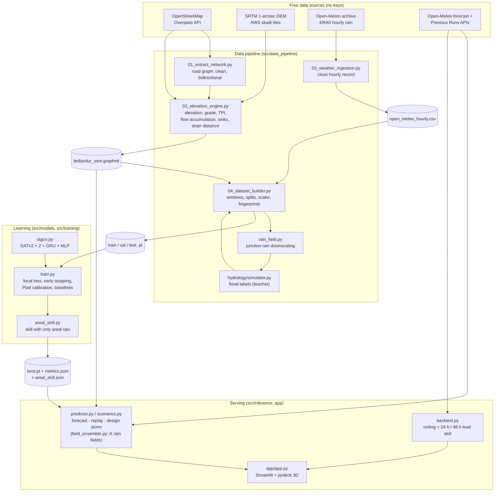

# Namma-Flow — Project Brief

> Predictive urban micro-flooding for Bengaluru: junction-level flood probabilities 12–48 hours ahead,
> computed by a spatio-temporal graph neural network over the OpenStreetMap road graph. The labels are simulated,
> and the headline score measures emulation of the simulator given its own junction rain field; the skill with only
> corridor-average rain, and with real forecasts, is reported next to it (§10).

This brief explains **what the system does, how every part works, and why it was built that way**.
For installation and commands see [README.md](README.md); the original specification is
[PROJECT_SPEC.md](PROJECT_SPEC.md).

---

## Contents

1. [Executive summary](#1-executive-summary)
2. [Problem and approach](#2-problem-and-approach)
3. [System architecture](#3-system-architecture)
4. [Data sources, fallbacks and offline mode](#4-data-sources-fallbacks-and-offline-mode)
5. [Pipeline stages](#5-pipeline-stages)
6. [The hydrology "teacher" simulator](#6-the-hydrology-teacher-simulator)
7. [The model](#7-the-model)
8. [Loss functions](#8-loss-functions)
9. [Training, calibration and evaluation](#9-training-calibration-and-evaluation)
10. [Results](#10-results)
11. [Inference, scenarios and backtesting](#11-inference-scenarios-and-backtesting)
12. [The 3D dashboard](#12-the-3d-dashboard)
13. [Edge cases and robustness](#13-edge-cases-and-robustness)
14. [Security measures](#14-security-measures)
15. [Configuration reference](#15-configuration-reference)
16. [Testing and quality](#16-testing-and-quality)
17. [Limitations and honest caveats](#17-limitations-and-honest-caveats)
18. [Extending the project](#18-extending-the-project)
19. [Glossary](#19-glossary)

---

## 1. Executive summary

| | |
|---|---|
| **Goal** | Probability *p* ∈ [0, 1] that each street junction is inundated (≥ 15 cm of standing water), for every hour of the next 12–48 h |
| **Pilot area** | Bellandur / Outer Ring Road corridor, bbox `[77.655, 12.915, 77.700, 12.950]` (~4.9 × 3.9 km): 1,035 junctions, 2,406 directed street segments |
| **Model** | `SpatioTemporalFloodGNN` — two GATv2 attention layers over the road graph per hour, a GRU cell carrying state across hours, an MLP head (exactly the spec architecture) |
| **Inputs** | 5 static junction descriptors (elevation, distance to drain, relative elevation, flow accumulation, sink flag) + 5 rainfall features (hourly rain and 3/6/12/24 h sums); 2 edge features (length, grade) |
| **Labels** | A calibrated, mass-conserving urban-drainage simulator run over the same road graph (no public junction-level flood record exists) |
| **Training data** | Open-Meteo ERA5 hourly rainfall 2018–2024 (61,368 h) → 944 training windows; validation year 2022, held-out test year 2024 |
| **Outputs** | Calibrated probabilities, risk tiers, uncertainty (spread across rain-field realisations and MC dropout), GeoJSON/CSV exports, a 3D Streamlit + pydeck dashboard |
| **Result (held-out 2024)** | Three numbers, because they answer three different questions (see [§10](#10-results)): given the teacher's own junction rain field (emulation), PR-AUC **0.953** (strongest graph-free baseline, gradient-boosted trees: 0.902); given only corridor-average rain, as in every forecast or what-if storm, **0.667** (32-field ensemble; the teacher itself, averaged over rain fields, reaches about 0.70); driven by 24 h / 48 h-old forecasts (Aug–Nov 2024 backtest), **0.070 / 0.120** |
| **Cost** | $0 — OpenStreetMap, SRTM (AWS public tiles), Open-Meteo; no API keys; runs on a laptop CPU |
| **Robustness** | Every stage has a documented fallback chain and a fully offline mode; more than 1,400 automated tests |

What you can do with it:

- **Live forecast** — pull the Open-Meteo forecast for the corridor and see which junctions are likely to flood over
  the next 48 h, hour by hour. Only corridor-average rain is forecast, so the probabilities are averaged over 32
  random junction rain fields.
- **Historical replay** — replay any storm of 2018–2024 (e.g. the September 2022 Outer Ring Road floods) exactly as the
  model saw it during training, including the junction rain field the labels were made from.
- **What-if design storms** — "what happens if 80 mm falls in 3 hours?" with presets and custom storms (also averaged
  over 32 rain fields).
- **Forecast backtest** — measure skill when the model is driven by 24 h- and 48 h-old forecasts instead of observed
  rain (Open-Meteo Previous Runs archive), next to what it reaches with a perfect areal forecast.
- **Physics baseline** — the label simulator itself is available as a predictor, so the dashboard works before any
  model has been trained.

---

## 2. Problem and approach

Bengaluru floods in a very local way. A 30-minute convective burst can put the Silk Board or Bellandur junctions under
knee-deep water while streets 2 km away stay dry. The city sits on a plateau of ridges and valleys, with a cascade of
lakes (Bellandur, Varthur) linked by storm-water drains (*rajakaluves*). Runoff runs downhill along streets, collects
in depressions and backs up where drains are overloaded or the downstream lake level is high.

**Core hypothesis (from the spec).** Micro-flooding is governed by the coupling of *topography* (elevation gradients,
valley lines, drains) and *short-duration local rainfall intensity*. If the road network is modelled as a graph,
message passing along street edges can learn how runoff accumulates at downstream junctions over time.

The approach, in five steps:

1. **Represent the city as a graph.** Junctions are nodes and street segments are directed edges in both directions,
   because water ignores one-way rules. Terrain and drainage descriptors are attached to nodes, and length and slope to
   edges.
2. **Give every junction its own rainfall.** Reanalysis gives one rain value per hour for the whole corridor, so a
   stochastic convective-cell model downscales it into a realistic, spatially varying field: one random draw per
   storm.
3. **Create labels with physics.** A simple but physically consistent dual-drainage model routes that rain over the
   graph and produces a water depth per junction and hour. Its parameters are calibrated so the labels behave like
   Bengaluru micro-floods.
4. **Learn a fast emulator.** The GNN learns to predict the teacher's flooding from junction rain and terrain. It
   gives calibrated probabilities and uncertainty, and can later be fine-tuned on real flood reports.
5. **Handle the unknown field when only areal rain is known.** A forecast or a what-if storm gives corridor-average
   rain, not the junction field of step 2. The predictor therefore averages over several random field realisations,
   and the skill of that setting is measured separately from the emulation score (§9, §10).

---

## 3. System architecture



**Artifacts**

| File | Produced by | Contents |
|---|---|---|
| `data/interim/bellandur_osm.graphml` | stage 01 (+02) | Enriched road graph (DiGraph, EPSG:4326) |
| `data/interim/waterways.geojson` | stage 01 / 02 (elevation engine) | Cached OSM drains, streams, canals and lakes |
| `data/interim/osm_cache/` | osmnx | Raw Overpass responses (enables offline rebuilds) |
| `data/raw/dem/N12E077.hgt.gz`, `srtm_<bbox>.tif` | stage 01 / 02 (elevation engine) | SRTM tile and its clipped GeoTIFF |
| `data/raw/weather/open_meteo_hourly.csv` (+ `.meta.json`) | stage 03 | Hourly areal rainfall with provenance |
| `data/raw/labels/flood_reports.csv` | user | Header-only template for observed flood reports |
| `data/processed/{train,val,test}_dataset.pt` | stage 04 | Compact tensors + metadata (see §5.5) |
| `data/processed/dataset_manifest.json` | stage 04 | Build id and size / sha256 of each split, written last |
| `artifacts/checkpoints/best.pt` | training | Final calibrated model with both alert thresholds (the only file served) |
| `artifacts/checkpoints/last.pt`, `best_candidate.pt` | training | Resume point; per-epoch best (never served) |
| `artifacts/reports/metrics.json`, `training_history.csv`, `areal_skill.json` | training | Final metrics (test headline), per-epoch history, skill with only areal rain; published together with `best.pt` |
| `artifacts/reports/.training_history.partial.csv` | training | Per-epoch history of the run in progress (staging) |
| `artifacts/reports/dataset_summary.json` | stage 04 | Windows, flood rates and fingerprints per split |
| `artifacts/reports/prediction.geojson`, `backtest.json`, `backtest_physics.json` | inference CLI | Latest prediction; forecast backtest of the GNN / of the physics baseline |

**Code map**

```text
src/
├── utils/          config (load/validate/merge), geo, http (retries, offline guard), runtime (seeding,
│                   device, atomic writes), logger, demo_dir (offline-demo folder safety)
├── data_pipeline/  01–04 stage CLIs; network* (+ overpass_guard), elevation*, enrichment, terrain, drains,
│                   weather*, rain_field, features, dataset* (+ dataset_manifest), windows, provenance,
│                   sequence_dataset, graph_io
├── hydrology/      simulator, drainage, params, calibrate, label_diagnostics, observed
├── models/         stgcn (SpatioTemporalFloodGNN, A3TGCNFlood), loss (FocalLoss, WeightedBCELoss)
├── training/       train CLI, trainer, finalize, calibration, metrics, baseline, checkpoint, splits,
│                   settings, evaluation, reports, run_state, areal_skill (+ areal_fields)
└── inference/      predict CLI, predictor, field_ensemble, scenarios, record, results, backtest,
                    checkpoint_loading, errors, settings
app/                app, banners, components, loaders, map_layers, metrics_view
tests/              40 test modules + shared fixtures (conftest.py, dataset_fixtures.py, training_fixtures.py)
```

---

## 4. Data sources, fallbacks and offline mode

All data is free and needs no API key. Every source has a fallback chain, so a missing source degrades the run
instead of stopping it. The chain never *silently* downgrades real data to synthetic data.

| Input | Source (online) | Fallback chain |
|---|---|---|
| Road network | OSM via osmnx: place query `project.region`, then bbox query `region.bbox` | Place query rejected if it is a water body, larger than `max_place_area_km2`, outside the bbox or yields < `min_place_nodes` junctions → bbox query → each mirror in `network.overpass_urls` (a mirror answering HTTP 429/504 is given up after `overpass_max_attempts` attempts) → replay from the osmnx cache (offline) → synthetic street grid (only if no real graph exists, or with `--allow-synthetic`) |
| Elevation | SRTM 1-arcsecond tiles from the public AWS "skadi" bucket | Local GeoTIFF in `data/raw/dem/` covering the bbox → cached SRTM clip/tile → SRTM download → Open-Meteo elevation API (≤ 100 points per call) → synthetic valley formula from the spec. A source is rejected if > 50 % of junctions are voids |
| Drains & lakes | OSM `waterway=drain\|canal\|stream\|river\|ditch` and `natural=water` via each Overpass mirror | Cached `waterways.geojson` → synthetic north–south drain line at `region.drain_fallback_lon`. Treatment tanks, pools and fountains (`water=wastewater\|pool\|…`) are excluded |
| Hourly rainfall | Open-Meteo historical archive (ERA5 best-match), chunked by year | Cached CSV (reused only if it covers the range) → archive fetch of missing hours only → synthetic Bengaluru climatology at ERA5-like areal scale (seeded) |
| Live forecast | Open-Meteo forecast API (2 past days + 3 forecast days) | App/CLI replay the most recent notable storm of the record (CLI `--no-fallback` fails instead) |
| Archived forecasts | Open-Meteo Previous Runs API (`precipitation_previous_day1/2`, from ~2024) | Backtest reports `status: unavailable` without raising |
| Basemap | Carto tiles (browser) | Data layers still render without a basemap |

**Real-data facts of the current build**

| Item | Value |
|---|---|
| Geocoder result for "Bellandur, Bengaluru…" | Bellandur **Lake** polygon (3.15 km²) → correctly rejected, bbox used |
| Road graph | 1,035 junctions, 2,406 directed edges, one connected component, ~103 km of street |
| OSM snapshot | 2026-09-23T12:50:49Z (Overpass `timestamp_osm_base` of the cached bbox query; a fresh clone gets current OSM unless `network.osm_date` is set). The snapshot was recovered from the Overpass cache after training (the graph attribute digest 16f45ad291f32cd9 is unchanged); `best.pt`, `dataset_summary.json` and `dataset_manifest.json` record it as "unknown" until the datasets are rebuilt and the model retrained |
| Elevation | SRTM, 868.9–899.8 m (mean 884.9), 0 voids |
| Relative elevation (TPI, 300 m) | −7.9 … +6.8 m |
| Sinks | 260 junctions (25 %) have no lower neighbour; max flow accumulation 28 |
| Drains / water bodies | 382 OSM features used (286 lines, 133 polygons fetched; 37 wastewater tanks excluded); distance median 279 m, max 720 m |
| Rainfall | 61,368 hourly values 2018-01-01 → 2024-12-31, 0 % imputed; annual totals 717–1,348 mm (mean ≈ 1,009 mm) |

**Offline mode.** `--offline`, `NAMMA_FLOW_OFFLINE=1` or `project.offline: true` blocks every network call through
one guard (`src/utils/http.py` and the osmnx wrappers). After one online run has filled the caches, the entire real
pipeline can be rebuilt offline: the road graph is replayed from the osmnx cache, elevation comes from the cached
SRTM clip, drains from `waterways.geojson` and rain from the CSV. With no caches at all, a synthetic demo (street
grid, valley elevation, straight drain, synthetic rain) keeps every stage runnable. Its numbers have no physical
meaning.

**Caching and atomicity.** Every artifact is written through `atomic_write_*` / `atomic_torch_save`: a temp file in
the same directory, then `os.replace`, with normal umask-derived permissions. A crash therefore never leaves a
half-written graph, dataset or checkpoint. Files that belong together are published together: stage 04 renames all
split files in one step and writes `dataset_manifest.json` last (§5.5), and training moves `best.pt`, `metrics.json`,
`training_history.csv` and `areal_skill.json` into place back to back (§9).

---

## 5. Pipeline stages

The four stage scripts are thin CLIs over importable modules. Each accepts `--config` and `--offline`, prints a
summary, exits 0 on success, exits 1 with a one-line error on a handled failure, and exits 130 on Ctrl-C (stage 03
exits 1).

### 5.1 Stage 01 — road network (`01_extract_network.py`, `network*.py`)

- **Fetch.** Place query, then bbox query (osmnx 2.x `bbox=(west, south, east, north)`) with each mirror in turn,
  using the osmnx HTTP cache in `data/interim/osm_cache/`. Integral timeouts are passed as `int` so the query text,
  which is also the osmnx cache key, matches earlier cached responses.
- **Bounded retries** (`overpass_guard.py`). On HTTP 429/504, osmnx on its own sleeps about a minute and calls itself
  again, with no limit and no visible message, so a busy mirror could block the stage for hours without the next
  mirror ever being tried. While osmnx runs, the project replaces its request function with a wrapper: at most
  `network.overpass_max_attempts` (2) attempts per request and mirror, `overpass_retry_pause_s` (30 s) apart, a WARNING
  per attempt, then `NetworkUnavailable`, so the next mirror is tried. The same applies to the Nominatim place query
  and to the waterway query (`drains.py`). Everything is restored on exit.
- **OSM snapshot.** The wrapper also records the `timestamp_osm_base` of every Overpass answer, including answers
  replayed from the cache. Stage 01 stores it as the graph attribute `osm_base_utc` (plus `osm_query_utc` when
  Overpass was really queried) and prints it. `network.osm_date` pins the queries to a past snapshot (an Overpass
  `[date:…]` attic query), so a result can be rebuilt from the same OSM data later.
- **Clean** (`network_clean.py`, never mutates its input):
  - MultiDiGraph → DiGraph, keeping the shortest of parallel edges
  - drop self-loops, isolated nodes and nodes without coordinates
  - keep the largest weakly connected component (and log how much was dropped)
  - repair missing, NaN or non-positive lengths with the haversine length, with a minimum of `min_edge_length_m`
  - flatten list-valued OSM tags to strings
  - drop shapely geometries (for GraphML safety)
- **Bidirectional edges.** For every u→v a v→u twin is added (`reversed_added=True`), and both directions share the
  shorter length, so grades are exact negations.
- **Guards.**
  - Fewer than `network.min_nodes` junctions → a clear `GraphTooSmallError`.
  - An existing real OSM graph is never replaced by the synthetic grid, neither offline nor during an Overpass
    outage, unless `--allow-synthetic` is given.
  - A cached synthetic grid protects nothing, so an online run rebuilds it from OSM automatically (it is kept only
    if OSM is still unavailable).
  - A cached graph whose `network_config_hash` differs from the current config produces a warning that suggests
    `--force`. Fetch-only keys (timeouts, mirrors, retry settings) are not part of that hash.
- **Enrichment.** The stage calls the stage-02 engine (`elevation.enrich_graph`) and saves the result with
  `graph_io.save_graph`, which sanitises attribute types. The graph records the settings it was enriched with
  (`enrichment_config_hash`, over the effective `elevation`, `drains` and `region` keys that change the attributes,
  plus `network.min_edge_length_m`; endpoints, timeouts and refresh flags are excluded).
  Re-running without `--force` reuses the file, and re-enriches it only when attributes are missing or those
  settings changed (with a WARNING). Every re-enrichment goes through `enrichment.py`:
  - when only derived attributes are missing (relative elevation, flow accumulation, sinks, grade) and the settings
    did not change, they are recomputed from the stored elevations, with no DEM, waterway cache or network access;
  - otherwise the full elevation and drainage chain runs, and the result is refused when it would replace real
    elevations or real OSM drains with a synthetic fallback (for example offline without the DEM cache), unless
    `--allow-synthetic` is given.
- **Diagnostics never write.** `extract_network(persist=False)`, used by `calibrate`, builds or re-enriches the graph
  in memory only.

### 5.2 Stage 02 — elevation and drainage engine (`02_elevation_engine.py`, `elevation.py`, `terrain.py`, `drains.py`)

| Attribute | How it is computed |
|---|---|
| `elevation` (m) | Bilinear sampling of the DEM (handles raster edges and reprojects when the DEM CRS is not EPSG:4326); voids (nodata or outside `valid_range_m` 600–1200 m) are filled by inverse-distance weighting of the `void_fill_k` = 8 nearest valid junctions |
| `grade` (edge) | `(elev_v − elev_u) / length`, clipped to ±`max_abs_grade` (0.3); negative means downhill u→v |
| `relative_elevation` (m) | Topographic position index: elevation minus the mean elevation of junctions within 300 m (cKDTree in local metres); negative means a local depression |
| `flow_accumulation` | Each junction drains to its steepest strictly-lower neighbour; counts accumulate in descending-elevation order (O(N log N)) |
| `is_sink` | No strictly-lower neighbour (a local pit of the street network) |
| `dist_to_drain_m` | Distance in UTM metres to the nearest drain line or water-polygon boundary (0 inside a polygon), via a shapely STRtree, clipped to `drains.max_distance_m` |

Details that matter:

- SRTM tiles are downloaded, gunzipped, merged when the bbox spans several tiles, and clipped to the bbox plus a
  0.01° margin. The clip is written as a compressed GeoTIFF and reused afterwards. `--refresh-dem` forces a new
  download; offline, the flag is ignored with a warning.
- Invalid OSM geometries are repaired with `make_valid` and flattened recursively. Lakes that come back as a
  `GeometryCollection(MultiPolygon, …)` are therefore kept.
- Waterways are queried over the bbox plus a 0.02° margin, so edge junctions see drains just outside it. An empty
  Overpass answer is never cached as authoritative, and every mirror is tried (with the bounded retries of §5.1).
- `run_elevation_stage` refuses (exit 1, graph untouched) when it would replace SRTM elevation or OSM drains with
  synthetic values, unless `--allow-synthetic` is given. The same check guards the re-enrichment paths of stage 01
  and stage 04 (§5.1, §5.5).
- Water features that are not storm water (`drains.exclude_water_values`: treatment tanks, pools, fountains) are
  excluded when the waterway cache is used, by one predicate that the dashboard's drain layer reuses.

### 5.3 Stage 03 — weather ingestion (`03_weather_ingestion.py`, `weather*.py`)

- **Schema.** A tz-aware hourly index in Asia/Kolkata, strictly increasing and unique, with columns
  `precipitation_mm` (mm accumulated in the hour ending at the timestamp), `is_imputed` and `source`.
- **Cleaning.**
  - values are coerced to numeric; negative values → 0 (with a warning)
  - values above `max_precip_mm_h` (150 mm/h) are clipped
  - duplicates: the last one is kept; unsorted rows are sorted
  - tz-naive timestamps are localised; other timezones are converted
  - gaps up to `max_fill_gap_hours` are filled with 0 and flagged `is_imputed`; longer gaps are reported
  - `bias_correction_factor` is applied
- **Cache semantics.** The CSV never shrinks. A disjoint date range is stored as a separate gap-free block, with no
  zero-filled bridge between blocks. Only missing hours are fetched. A cache for another location is never
  overwritten offline. The end date is clamped to today minus 5 days, because the archive lags real time.
- **Reading a multi-block file.** Replays read the stored rows only (`weather_schema.read_weather_rows`), so hours
  between blocks stay absent. A reader that needs one continuous hourly range labels the hours that exist only
  through that reindexing `source = "missing"` (`is_imputed`, 0 mm), never as observations.
- **Synthetic climatology.** It is calibrated to the real ERA5 record: monthly normals fitted to it (wettest months
  October and July), about 147 wet days a year, and 2–16 h bursts. Months are generated with a spill-over pad, so there are no
  month-end artefacts. Output is deterministic from the seed, and any sub-range reproduces the same values.
- **Forecast and archived forecasts.** `fetch_forecast` returns past days plus forecast days with `is_forecast`.
  `fetch_previous_runs` returns `precip_lead_0 / _24h / _48h` for backtests.
- **Design storms.** `design_storm` builds Chicago, triangular or uniform hyetographs whose totals are conserved
  exactly (`math.fsum`).

### 5.4 Junction rainfall field (`rain_field.py`)

ERA5 gives one number per hour for the corridor, but Bengaluru's damaging storms are convective cells a few
kilometres across. `downscale_rainfall(areal, timestamps, lon, lat, cfg)` returns a `[T, N]` field whose mean over the
junctions equals the areal value in every hour.

- **Events.** Maximal runs of wet hours, allowing ≤ 2 dry hours inside. Each event has one steering velocity (1–6 m/s,
  random heading) and 3 cell slots.
- **Cell lifecycle.** Each slot hosts overlapping generations of Gaussian cells (radius 400–1,200 m, lifetime 2 h).
  Intensity grows to a peak at mid-life and decays; generation envelopes sum to one, so convection never switches off
  inside an event. A cell's mature position is uniform over the bbox plus a margin. The domain is **not** periodic.
- **Hourly accumulation.** Each hour is the mean of 4 sub-steps, so a moving cell leaves a streak rather than a
  snapshot. Overlapping cells combine as `1 − Π(1 − a·g)`.
- **Conditioning.** Each wet hour's pattern is rescaled so the most-affected junction reaches the strongest cell's
  amplitude (gain ≤ 20). The stratiform share falls with rain rate, `b = 0.2 · 2 / (2 + areal)`: intense hours are
  dominated by convective cores.
- **Normalisation.** `field = b + (1 − b) · intensity`, normalised to mean 1, clipped to [0.05, 4] and renormalised,
  then multiplied by the areal value. Dry hours are exactly zero.
- **Determinism.** Each event is seeded from `(rainfall_field.seed, event start hour)`. Replaying any sub-range that
  starts at an event start (inference extends history back to the start of an in-progress event) reproduces the
  training field exactly. Design storms are drawn on a fixed canonical time axis, so the same what-if storm gives the
  same junction pattern at any wall-clock time.
- **One draw per storm, and it matters.** The labels are simulated from this one random field per event, and the
  field decides much of where floods occur: with uniform rain the teacher's labels overlap the real ones with a
  Jaccard index of only 0.46 (criterion (g), §6). Areal rain, even perfectly known, cannot say where the cells fell.
  This is why forecasts and what-if storms average over several field seeds (§11.2), and why the areal-only skill is
  reported separately (§9, §10).
- **Heterogeneity on the real record.** The median within-hour coefficient of variation is 0.46 (target 0.3–0.7) and
  the p95 max/mean multiplier is 3.9. The full 61k h × 1,035 field takes about 2 s.

### 5.5 Stage 04 — features and datasets (`04_dataset_builder.py`, `dataset*.py`, `features.py`, `windows.py`, `provenance.py`)

**Node features** (one definition, `features.build_node_features`, shared by training and inference, so features
are computed identically in both):

| # | Feature | Normalisation |
|---|---|---|
| 1 | `elevation` (m) | z-score (train split) |
| 2 | `dist_to_drain_m` | z-score |
| 3 | `relative_elevation` (m) | z-score |
| 4 | `flow_accumulation` | `log1p`, then z-score |
| 5 | `is_sink` (0/1) | z-score |
| 6 | `precip_mm_h` — junction rain in the hour | `log1p`, then z-score |
| 7–10 | `rain_3h_mm`, `rain_6h_mm`, `rain_12h_mm`, `rain_24h_mm` — trailing sums over (t−w, t] | `log1p`, then z-score |

Edge features: `length` (`log1p`, then z-score) and `grade` (divided by `max_abs_grade`, so it lies in [−1, 1]). The
fitted `FeatureScaler` is stored in every dataset and checkpoint.

Why `flow_accumulation` and `is_sink`: a probe showed that a graph-free MLP on the first three terrain features plus
rain reached only 0.56 validation PR-AUC. Smooth networks cannot resolve each junction's individual flood threshold
from raw elevation numbers. Adding these two hydrological descriptors lifted the same MLP to 0.91. The GNN keeps its
graph structure to learn how upstream rain and routing modify that susceptibility.

**Windows and splits**

- **Windows.** `seq_len` = 16 consecutive hours. The first `warmup_steps` = 4 only warm the GRU state; the last 12
  are scored. Each window needs `lookback_hours` = 24 h of rain history for the rolling sums. Windows must start in
  the May–Nov monsoon months. A window is *wet* if its areal rain is ≥ 5 mm; dry windows are kept with probability
  0.05 as easy negatives (seeded).
- **Splits by calendar year** of each window's last hour: **train** 2018–2021 + 2023, **validation** 2022 (contains
  the Sept 2022 ORR floods), **test** 2024 (held out; also the year the forecast backtest covers). Windows that
  straddle two splits are dropped. The scaler is fitted on train only.
- **Strides.** Train windows start every 6 h. Validation and test windows start every 12 h, which equals the number
  of scored steps, so each scored junction-hour is counted exactly once.
- **Label simulation** runs once over the full continuous record, so hydrologic state carries across windows, and
  labels are then sliced per window.

**Storage.** Each split stores only the union of hours its windows need: `rain` float32 [H, N], `labels` uint8,
`depth` float16 and `timestamps` int64. `window_starts` indexes into them; contiguity is asserted. Features are
computed on the fly in `__getitem__`, so the files stay small: train 104 MB, validation 17 MB, test 18 MB.

| Split | Windows | Windows with floods | Flooded node-steps |
|---|---|---|---|
| Train (2018–2021, 2023) | 944 | 541 (57 %) | 2.51 % |
| Validation (2022) | 103 | 67 (65 %) | 3.25 % |
| Test (2024) | 103 | 56 (54 %) | 2.38 % |

**Reuse and staleness detection.** A rebuild is skipped only if all of these still match, and the log says which
input changed:

- the **dataset config hash**, which covers exactly the settings stage 04 applies itself: the whole `rainfall_field`,
  `hydrology`, `labels` and `dataset` sections, hashed as written in the config (so adding or removing a key there,
  even one set to its default, changes the hash), plus `project.timezone`, `region.bbox`, `elevation.max_abs_grade`
  and the record-shaping `weather` keys (`provider`, `start_date`, `end_date`, `latitude`, `longitude`, `models`,
  `bias_correction_factor`, `max_precip_mm_h`, `max_fill_gap_hours`, `synthetic_scale`), these individual keys with
  defaults applied. Fetch-only keys (URLs, timeouts, retries, forecast settings) are not hashed, so they never mark
  datasets or models stale.
- graph topology signature
- graph **attribute digest** (a sha256 over static node features and edge length/grade)
- **weather fingerprint** (timestamps, rain and source counts)
- flood-reports fingerprint (when observed labels are used)
- the **dataset manifest**, which must name the build of every split file

The graph is checked before that: missing attributes or a changed `enrichment_config_hash` make stage 04 re-enrich
it (§5.1), with the same refusal of synthetic downgrades and no override.

**All-or-nothing commit** (`dataset_manifest.py`). Every split is written to a temporary file next to its target
first. Then the old manifest is removed, all files are renamed into place, and `dataset_manifest.json` (build id,
and file name, size and sha256 per split) is written last. An interruption before the renames leaves the previous
build untouched; one during them leaves split files without a matching manifest, which count as stale and are
rebuilt. Training independently refuses splits whose `build_id`, config hash, weather or report fingerprints differ
(§9).

Payloads load with `torch.load(weights_only=True)` only; a file that needs the full unpickler is refused.

---

## 6. The hydrology "teacher" simulator

No public, junction-level flood record exists for Bengaluru, so labels come from a deliberately simple, fully
vectorised, **mass-conserving dual-drainage model** that runs over the road graph itself
(`src/hydrology/simulator.py`, `drainage.py`, `params.py`). Every junction *i* owns a small surface reservoir
(the major system: road surface, kerbs, depressions). The reservoir is fed by the road strip around the junction,
connected to its neighbours by overland flow, and drained by street inlets into a minor system (storm drains) that
can surcharge.

| Term | Formula / rule |
|---|---|
| Catchment | `A_i = catchment_width_m (30 m) × Σ half-length of incident segments`; pondable area `ponding_fraction × A_i` |
| Runoff | `q_i = C_i(t) · max(r_i − infiltration, 0) / 1000 · A_i` m³/h; `C` rises from `runoff_coeff_dry` 0.70 to `runoff_coeff_wet` 0.80 as the previous 24 h of rain approaches `antecedent_saturation_mm` |
| Inlet capacity | `cap_i = far + (near − far) · exp(−dist_to_drain / drain_decay_m)` mm/h (17.5 near a rajakaluve/lake, 13.4 far, decay 450 m) |
| Local surcharge | Drains serving *i* carry the runoff of *i*'s whole contributing area. The loading `L_i` is the flow-weighted mean rain over that area over `surcharge_window_h` (6 h), computed with the contributing-area operator `K = diag(1/CA) · (I − R)⁻¹ · diag(A)`. The excess is `E_i = clip((L_i − 4.1 mm) / 3.4 mm, 0, 1)` |
| Tailwater gate | Backwater needs raised trunk drains or lake levels, so `G(t)` rises from 0 to 1 as corridor-mean 6 h rain goes from 3.7 to 5.0 mm |
| Capacity multiplier | `s_i = 1 − (1 − 0.055) · E_i · G`: the gate decides **when** backwater is possible; the local loading decides **where** |
| Routing | Multiple-flow-direction over the undirected road adjacency. A junction releases `min(1, 1.5 · max(slope_i, 0.0022) / 0.01)` of its water per hour to strictly-lower neighbours ∝ `(drop/length)^k`, with weights normalised by the steepest slope first, so no underflow is possible. Sinks keep their water |
| Spill | Water deeper than `spill_depth_m` (0.55 m) leaves the network overland |
| Label | `flooded = depth ≥ 0.15 m`, where `depth = storage / (ponding_fraction · A)` |

Each hour runs rain → inlets → routing → spill. The **mass balance closes exactly** (relative error about 1e-16):
inflow = Δstorage + drained + spilled. Non-finite budgets raise `SimulationError`. The simulation takes about 2.4 s
for 61,368 h × 1,035 junctions.

**Calibration** (`python -m src.hydrology.calibrate --strict`) runs the full label chain exactly as stage 04 does, on
the real graph and the 2018–2024 record:

| Criterion | Target | Before redesign | **Current** |
|---|---|---|---|
| (a) flooded node-hours, May–Nov | 0.5–3 % | 0.774 % | **0.591 %** |
| (b) floods when 6 h areal rain < 4 mm | 0 | 0 | **0** |
| (c) Sept 4–5 2022 peak, share of junctions flooded | 10–50 % | 61.9 % ✗ | **42.4 %** |
| (d) flood frequency vs relative elevation / flow accumulation / sink (Spearman) | < 0 / > 0 / > 0 | −0.44 / +0.60 / +0.75 | **−0.45 / +0.60 / +0.75** |
| (e) rain events per year that flood somewhere | ≥ 15 | 23.9 | **41.1** |
| (f) rank-1 (hour × node) R² of the labels — degeneracy check | < 0.6 | 0.806 ✗ | **0.502** |
| (g) Jaccard of labels vs uniform (non-spatial) rain — spatial rain matters | < 0.75 | 0.953 ✗ | **0.464** |
| (h) median share of junctions flooded, in hours with any flood | < 25 % | 32.2 % ✗ | **8.3 %** |
| (rf) junction-rain CV in wet hours / p95 max-to-mean ratio | 0.3–0.7 / ≥ 2 | 0.083 / 1.47 ✗ | **0.464 / 3.93** |

The "before" column is the first design, where one basin-wide surcharge switch decided everything and the rain field
was nearly uniform. An adversarial review showed those labels were "one rain switch × a fixed junction map", with
almost no spatial signal. The redesign added the local contributing-area surcharge, the tailwater gate and the
heterogeneous cell-lifecycle rain field, so labels now depend on **where** rain falls and on **runoff accumulating
downhill**, the spec's core hypothesis. Sinks flood 1.79 % of season hours against 0.19 % for other junctions. The
peak simulated depth is 0.55 m (the spill cap).

**Observed flood reports (optional).** `data/raw/labels/flood_reports.csv` has the columns `timestamp, lat, lon,
radius_m, severity, description`. It ships header-only, because fabricated reports would contaminate the labels.
With `labels.source: observed | hybrid`, each report is snapped to the junctions within
`max(radius_m, report_snap_radius_m)` for ±`report_window_hours` hours and filtered by `min_report_severity`. Bad
rows are dropped with a warning. `hybrid` takes the union with the simulated labels.

---

## 7. The model

### 7.1 `SpatioTemporalFloodGNN` (spec architecture, `src/models/stgcn.py`)

```text
x_t [N, 10] ──GATv2Conv(10 → 64, heads=2, concat, edge_dim=2)──ELU──Dropout(0.2)
             ──GATv2Conv(128 → 64, heads=1, edge_dim=2)──ELU
             ──GRUCell(64, 64) with h_{t-1} ──► h_t
             ──Linear(64 → 32)──ReLU──Dropout(0.2)──Linear(32 → 1)──► logit_t   (sigmoid → p_t)
```

- The layers and their order are exactly those of the spec. `forward(x, edge_index, edge_attr, hidden_state)`
  returns `(probs, h)` as specified.
- `forward_logits` returns logits, for numerically stable losses. `forward_sequence(x_seq [T, N, F], …)` runs a
  whole window.
- 47,169 trainable parameters with 10 input features.
- **Fast sequence execution.** The GATv2 stack does not depend on the GRU state, so `forward_sequence` stacks several
  hours into one batched graph call. `spatial_chunk` hours are capped by `max_chunk_edges` = 180k stacked edges.
  Only the cheap GRU cell loops over time.
- **Gradient checkpointing** (`model.gradient_checkpointing: true`, the default). Each time chunk (GATv2 + GRU + head) is recomputed during backward, and only the hidden
  states at chunk boundaries are kept. This bounds memory (about 1.3 GB during training) with identical outputs and
  gradients; the dropout RNG is preserved.
- **Tested equivalences.**
  - Outputs are numerically identical to the naive per-hour loop in eval mode.
  - Batching B windows as a block-diagonal graph of B × N nodes equals running each window alone.
  - Graphs with zero edges, N = 1 and T = 1 are handled.
  - Invalid shapes and NaN/inf inputs raise a clear `ValueError`.

### 7.2 `A3TGCNFlood` (alternative, `model.architecture: a3t_gcn`)

A T-GCN cell (GCN-gated GRU, with edge weights derived from length and grade) plus causal temporal attention over the
hidden states of the window, following the A3T-GCN idea mentioned in the spec's layout. It has the same interface and
is selectable in the config. The spec model is the default.

### 7.3 Helpers

- `build_model(model_cfg)` validates dimensions and the architecture name.
- `count_parameters(model)` counts trainable parameters.
- `enable_mc_dropout(model)` keeps eval mode but re-enables Dropout layers, for uncertainty estimates.

---

## 8. Loss functions

`src/models/loss.py`:

- **`FocalLoss(gamma=2.0, alpha=0.85)`** (default, from the spec). It is binary focal loss (Lin et al.), computed
  stably from logits through BCE-with-logits, with alpha weighting the rare *flooded* class. A per-step mask
  `[T]` excludes GRU warm-up hours, and an empty mask gives 0 with a gradient. Reductions are
  `none | sum | mean`; the probability input is clamped.
- **`WeightedBCELoss(pos_weight=None)`** is the alternative. `pos_weight = (1 − pos_rate) / pos_rate`, clipped to
  [1, 1000], when not given.

Tests cover several properties:

- the loss equals 0.5 × BCE at γ = 0, α = 0.5
- hand-computed reference values
- logits and probabilities agree
- ±100 logits stay finite
- all-negative batches work
- alpha and gamma are validated

---

## 9. Training, calibration and evaluation

`python src/training/train.py` → `src/training/{trainer, finalize, calibration, metrics, baseline, checkpoint,
splits, settings, areal_skill}.py`.

**Loop**

- Seeding covers Python, NumPy and torch. The device is `auto`: CUDA if present, else CPU. MPS is never
  auto-selected, because it was no faster in benchmarks here and several PyG kernels fall back to CPU on it.
- Train, validation and test datasets must share the graph signature, attribute digest and feature names, and they
  must come from one build (`build_id`, dataset config hash, weather and flood-report fingerprints). Splits from
  different builds, for example after an interrupted rebuild, raise `TrainingError`, because early stopping,
  calibration and the reported metrics would otherwise use labels of another teacher. Stale datasets (built with an
  older config hash) are warned about, and training continues on them: rebuild them first with stage 04.
- **Sampler.** A `WeightedRandomSampler` draws `windows_per_epoch` = 512 windows per epoch, and windows containing a
  flood get weight × `positive_oversample` = 3.
- **Batching.** `model.batch_size` is 16 (spec) and is split into `micro_batch_size` = 4 with gradient accumulation.
  The gradient is identical to a batch of 16, and it runs about 1.5× faster on CPU. That gives 32 optimizer steps
  per epoch.
- **Optimizer.** AdamW (lr 0.001 from the spec, weight decay 1e-4), gradient clipping at norm 1.0, and
  ReduceLROnPlateau (×0.5, patience 4, min 1e-5).
- **Non-finite losses or gradients** are skipped with a warning; the run aborts after 3 in a row.
- **Validation** runs every epoch: PR-AUC (the monitor), ROC-AUC, F2 at the best threshold, and val loss.
  - Early stopping uses patience 10 with a **relative** `min_delta`, which suits rare-event PR-AUC scales.
  - If validation has no floods, the monitor falls back to val loss.
  - `training.max_val_windows` (`--max-val-windows`) subsamples the windows scored per **epoch** only. The final
    calibration, both thresholds and the reports always use every validation window.
- **Checkpoint files** (format v2):

  | File | When written | Served? |
  |---|---|---|
  | `last.pt` | every epoch, atomically | no (used by `--resume`) |
  | `best_candidate.pt` | on each improvement | no (uncalibrated) |
  | `best.pt` + `metrics.json` + `training_history.csv` + `areal_skill.json` | **published together only at the end** | `best.pt` |

  During training the per-epoch history goes to the staging file `.training_history.partial.csv`. An interrupted
  or crashed run therefore never replaces a previously published model, and the app never shows its curve next to
  that model.
- **Resume** (`--resume`) restores model, optimizer, scheduler, RNG states (CPU/CUDA/MPS), history and the
  best score.
  - It is refused when the model, the features, the graph, the scaler or the window geometry differ, and when the
    dataset **build** differs (`build_id`, dataset config hash, weather or report fingerprint): the stored best score,
    early-stopping state and weights would come from other labels. Retrain from scratch then.
  - When only the validation windows changed (another `max_val_windows`), the run's best candidate is re-scored on
    the current validation set, and early stopping and the LR plateau counter restart from that score.
  - Ctrl-C never saves half-trained weights under a completed-epoch label.
  - If the monitor metric changes, the scheduler and early-stopping state are reset consistently.

**Finalisation**

1. Reload the best epoch.
2. Fit **Platt scaling** `p = σ(a · logit + b)` on the **validation** logits. The negative log-likelihood is jointly
   convex in (a, b), so it is minimised directly inside the box `a ∈ [0.05, 20]`, `b ∈ [−20, 20]` with scipy's
   L-BFGS-B and an analytic gradient. The optimum is compared with the identity (1, 0), the intercept-only fit and a
   near-constant fit at the base rate, and the lowest NLL wins; an active bound is logged. Temperature-only scaling
   was replaced because focal α and oversampling shift logits by a constant, which a pure temperature cannot remove.
3. Choose the alert **threshold** on calibrated validation probabilities by F2, which weights recall: a missed flood
   costs more than a false alarm.
4. Report metrics on the **test year**: PR-AUC, ROC-AUC, F1, F2, precision, recall, CSI, Brier, ECE, log loss,
   reliability curve, and per-step-in-window metrics.
5. Fit two **graph-free baselines** on the same per-junction-hour features: logistic regression and
   HistGradientBoosting. They use a seeded, class-balanced 200k-sample subsample of train and are calibrated and
   thresholded on validation. `strongest_baseline` records the best of them.
6. Choose the **areal serving threshold** (`best.pt["areal_threshold"]`, details in `areal_threshold_info`) when
   `training.areal_skill.enabled`. The threshold of step 3 is optimal for probabilities driven by the exact junction
   rain field. Forecasts and what-if storms average over 32 independent fields, which spreads probability mass (a
   junction that floods in 12 of 32 fields gets p ≈ 0.375 instead of 0 or 1), so the F2-optimal cut differs. It is
   chosen by F2 on the field-ensemble probabilities of the **validation** split, with `training.areal_skill.members`
   = 32 fields (keep it equal to `inference.field_members`); the test split stays untouched. The published model's
   areal threshold is 0.163 (validation F2 0.779), against 0.196 for exact fields. Any failure keeps `best.pt`
   without it, and the predictor then uses the step-3 threshold everywhere.
7. Measure the **areal-only skill** on the test split (below) when `training.areal_skill.enabled` (default true).
   A failure, for example a missing weather record, gives `status: "unavailable"` with a WARNING; it never fails
   the run.
8. Publish `best.pt`, `metrics.json`, `training_history.csv` and `areal_skill.json` together: each is staged to a
   temporary file, then all are renamed back to back. `best.pt` gets `created_utc = finalized_utc` (the publication
   time) and a `published_id` (a hash over the weights, calibration, alert threshold, run id and epoch), so a
   re-finalised model is a new identity. `metrics.json` has:
   - top-level headline metrics from the test split, with `evaluation_split: "test"` and a note that they measure
     emulation given the teacher's own junction rain field
   - `validation` and `test` blocks
   - `calibration`, `threshold`, `baselines`, `strongest_baseline`, `dataset` (hashes, windows, years), `model`,
     `training` and `status`
   - `areal_skill`: a compact summary (exact-field, field-ensemble, uniform and physics-ensemble PR-AUC, members,
     the areal threshold and the ensemble's F2 at it)

   Dataset paths in the model files are recorded relative to the project root (or as file names), never as
   absolute paths.

**Areal-only skill** (`areal_skill.py`, `artifacts/reports/areal_skill.json`). The headline test PR-AUC is computed
with the teacher's own junction rain field as input, so it measures emulation of the teacher given that field. A
forecast, a design storm or a custom scenario knows only the corridor-average rain. This evaluation scores the same
split, hours and labels with the published model when only that is known:

| Row | Junction rain given to the model |
|---|---|
| `exact_field` | the label field itself (reproduces the headline) |
| `field_ensemble` | mean calibrated probability over K = 32 (`training.areal_skill.members`) independent fields of the same areal rain, seeds `base + (1 + k) · 7919`, never the label seed: the ensemble the forecast and what-if modes serve, i.e. what the model reaches given a perfect areal forecast (the **areal-only score**; it improves with K and saturates around 32) |
| `field_ensemble_at_areal_threshold` | the same probabilities scored at the areal serving threshold |
| `single_other_field` | one independent field (member 0) |
| `uniform_areal` | the areal rain broadcast to every junction |
| `physics_other_field` | the teacher itself re-simulated with member 0's field and scored against its own labels at p > 0.5: a **single-field reference** (even the teacher cannot reproduce its labels without the label field) |
| `physics_field_ensemble` | the teacher averaged over the same K independent fields: an **estimate of the areal-only ceiling**, the best any predictor can do with only corridor-average rain. It is a Monte-Carlo estimate, biased low for small K, that rises with K (test 2024: 0.630 at K = 8, 0.690 at 32, 0.696 at 64), so compare it with the GNN ensemble at the same K |

Every field is generated like stage 04 does it, over the full weather record. A check first regenerates the label
field with the label seed; if it does not match the stored dataset rain (the weather record or the rain-field
settings changed since the build), the report is `unavailable`. The physics row runs from 30 days before the
split's first hour, starting dry, which reproduces the full-record labels exactly; the report re-checks that
(`teacher_label_mismatches`). Thresholded metrics use the exact-field alert threshold except where the row says
otherwise. On the real test split it takes about 3.5 min with 32 fields (218 s) and peaks at about 1.4 GB. The CLI `python -m src.training.areal_skill [--members N] [--split test|validation] [--threads N]`
recomputes it for the published model and prints every row, including the ensemble at the areal serving threshold
(`field_ensemble @ 0.163`).

---

## 10. Results

<!-- RESULTS:START -->
The results answer three different questions, so they come in three tables: (a) how well the GNN emulates the
teacher when it sees the teacher's own junction rain field; (b) what it can reach when only the corridor-average
rain is known, as in every forecast and what-if storm; (c) what it reaches when driven by archived 24 h / 48 h
forecasts.

Final training run: `gatv2_gru`, 47,169 parameters, CPU.

- 60 of 60 epochs, best epoch 59, 1,920 optimizer steps,
  ≈ 71 s per epoch, ≈ 71 min of summed epoch time.
- The published run was trained in two sessions (resumed after epoch 30, §9) and then re-finalised without further
  epochs, to choose the areal threshold with 32 rain fields; weights, calibration, exact-field threshold and
  headline metrics did not change. `metrics.json` `training.total_time_s` (23 s) times only that last process.
- Platt calibration fitted on validation 2022: slope 3.010, intercept -1.882.
- Alert thresholds chosen by F2 on validation: 0.196 for exact-field probabilities (replays) and
  0.163 for probabilities averaged over 32 rain fields (forecasts and what-if storms).

**(a) Given the junction rain field (emulation).** Held-out test year 2024: 103 windows × 1,035 junctions, 1.28 M
scored junction-hours, 2.38 % flooded, so a random ranking scores PR-AUC 0.024. The model is fed the exact synthetic
junction rain the labels were simulated from.

| Metric | **Namma-Flow GNN** | HistGradientBoosting (graph-free) | Logistic regression (graph-free) |
|---|---|---|---|
| PR-AUC | **0.953** | 0.902 | 0.699 |
| ROC-AUC | **0.999** | 0.997 | 0.989 |
| F2 @ threshold | **0.908** | 0.872 | 0.730 |
| Precision | **0.767** | 0.656 | 0.456 |
| Recall | **0.952** | 0.951 | 0.860 |
| CSI | **0.738** | 0.634 | 0.424 |
| Brier score | **0.0043** | 0.0063 | 0.0117 |
| ECE | **0.0003** | 0.0011 | 0.0028 |

Validation 2022, which was used for epoch selection, calibration and both thresholds: PR-AUC 0.958,
F2 0.917, precision 0.779, recall 0.960.

- **Given the field, the graph adds value.** Both baselines see exactly the same 10 per-junction-hour inputs but no
  road graph and no temporal state. The GNN's margin over gradient-boosted trees, +0.050 PR-AUC,
  combines what message passing over the streets and the GRU memory add (upstream rain and routing) with the GNN's
  larger training set: the baselines are fit on a class-balanced 200k-node-step subsample (198,099) of 400 of the
  944 training windows.
- **Given the field, the probabilities are reliable.** The mean predicted probability on test is 2.36 %
  against an observed rate of 2.38 %; ECE 0.0003, largest per-bin gap 0.032. The per-bin reliability
  curve is in `metrics.json` (`test.reliability`) and in the app.

**(b) Given only corridor-average rain (areal-only skill, §9).** The same test hours and labels, but the model gets
only what a forecast or a what-if storm can supply. Thresholded columns use the exact-field threshold
0.196 unless the row says otherwise.

| Junction rain given to the model | PR-AUC | ROC-AUC | F2 | Recall | Precision |
|---|---|---|---|---|---|
| Exact label field (the headline, emulation) | 0.953 | 0.999 | 0.908 | 0.952 | 0.767 |
| **Mean over 32 independent fields** (served in forecast and what-if modes: the areal-only score) | **0.667** | 0.988 | 0.718 | 0.816 | 0.486 |
| … the same, at the areal serving threshold 0.163 | 0.667 | 0.988 | 0.724 | 0.853 | 0.451 |
| One other field realisation | 0.450 | 0.943 | 0.507 | 0.528 | 0.439 |
| Uniform: corridor-average rain at every junction | 0.632 | 0.983 | 0.616 | 0.614 | 0.625 |
| Physics teacher with another field (p > 0.5; single-field reference) | 0.383 | 0.804 | 0.502 | 0.497 | 0.524 |
| Physics teacher, mean over the same 32 fields (p > 0.5; estimate of the areal-only ceiling) | 0.690 | 0.990 | 0.564 | 0.538 | 0.695 |

How the two ensembles depend on the number of rain fields K (test 2024 PR-AUC, published model). The physics
average is a Monte-Carlo estimate of the areal-only ceiling that is biased low for small K and rises with K:

| Rain fields K | 8 | 16 | 32 | 64 |
|---|---|---|---|---|
| GNN ensemble (areal-only score) | 0.619 | 0.655 | **0.667** | 0.670 |
| Physics teacher ensemble (estimate of the areal-only ceiling) | 0.630 | 0.673 | 0.690 | 0.696 |

**(c) Forecast backtest, 2024-08-01 → 2024-11-28** (120 days including the October 2024 floods; labels simulated
from the best-estimate rain with the label field, 14,882 flooded junction-hours; Open-Meteo Previous Runs; §11.6).
Each row's recall and precision use the threshold it is served with: the exact-field threshold 0.196 for `lead_0h`, the areal serving threshold 0.163 for the ensemble rows (physics: p > 0.5).

| Row | Rain driving the model | Junction rain field | Rain correlation | Junction-hour PR-AUC | 6 h-block PR-AUC | 24 h-block PR-AUC / recall / precision | Physics on the same rain and fields (junction-hour PR-AUC) |
|---|---|---|---|---|---|---|---|
| `lead_0h` | observed | exact label field | 1.00 | 0.948 | 0.941 | 0.933 / 0.933 / 0.740 | teacher (= labels) |
| `areal_ceiling` | observed: a perfect areal forecast | mean of 32 fields | 1.00 | **0.688** | 0.713 | 0.717 / 0.840 / 0.491 | 0.716 |
| `lead_24h` | 24 h-ahead forecast | mean of 32 fields | 0.21 | 0.070 | 0.101 | 0.153 / 0.323 / 0.194 | 0.049 |
| `lead_48h` | 48 h-ahead forecast | mean of 32 fields | 0.32 | 0.120 | 0.142 | 0.229 / 0.408 / 0.211 | 0.096 |
| Chance level (base rate) | | | | 0.005 | 0.011 | 0.030 | |

`make backtest` reproduces this report (online, about 14 min with 32 fields; §11.6).

How to read the three tables:

- **The headline measures emulation.** Table (a) shows how closely the GNN reproduces the teacher when it is given
  the teacher's own random junction rain field. No real input can supply that field, not a perfect forecast and not
  radar, because it is synthetic and drawn once per storm (§5.4).
- **With areal rain the scores are much lower.** Given only the corridor-average rain, the model reaches PR-AUC
  0.667 on test 2024 (the 32-field ensemble; uniform areal rain 0.632) and 0.688 in the backtest's
  perfect-areal-forecast row, against 0.953 with the exact field. Even the teacher scores only 0.383 when run with
  one other field, and 0.690 when averaged over 32 fields: much of the junction-level label pattern is set by the
  random field and cannot be predicted from areal rain.
- **Why forecasts serve the 32-field mean.** One random field scores 0.450 and is badly over-confident
  (ECE 0.019). Uniform areal rain ranks worse than the ensemble (PR-AUC 0.632 vs 0.667) and is mis-calibrated
  (ECE 0.012, mean probability 1.85 % against a 2.38 % flood rate). The 32-field mean ranks best, is calibrated
  (ECE 0.001, mean 2.32 %) and alerts best: F2 0.724 at its validation-chosen threshold 0.163, against 0.616 for
  uniform rain at the exact-field threshold (and 0.672 even at uniform's test-optimal threshold). So forecast and
  what-if modes serve the ensemble mean with that threshold, and its spread across fields shows the spatial
  uncertainty. The ensemble improves up to about 32 fields (0.619 with 8, 0.670 with 64), which is why 32 are
  served; a 48 h forecast then takes about 4 s (§11.2).
- **Lead time.** Forecast rain error lowers PR-AUC further, to 0.070 at 24 h and 0.120
  at 48 h: hourly convective rain is poorly predicted a day or two out, and forecast and observed areal rain
  correlate at only 0.21 and 0.32. Better rain forecasts (ensembles, nowcasting) can at most close the gap from
  these rows to the perfect-areal-forecast row, not to the headline.
- **Warning windows.** The blocks are fixed 6 h / 24 h blocks counted from the period start (calendar days here),
  and a hit means that the junction floods at any hour of the block. At 48 h lead, block scoring raises PR-AUC from
  0.120 to 0.229, mostly because the base rate rises from 0.5 % to 3.0 %. Relative
  to chance, that is 24× for junction-hours and 8× for 24 h blocks. Windows
  forgive timing errors of a few hours; they do not add skill.
- **Physics column and the areal-only ceiling.** In the ceiling row and at 24/48 h the physics column is the teacher
  driven by the same rain and fields, a fair baseline. Averaged over K fields, the teacher estimates the best any
  predictor can do when only the corridor-average rain is known, but only up to Monte-Carlo error: the estimate is
  biased low for few fields and rises with K, from 0.630 (K = 8) to 0.690 (K = 32) and 0.696 (K = 64) on the test
  year, so the areal-only ceiling is about 0.70. The GNN's 32-field ensemble reaches 0.667, about 0.02–0.03 below
  it (backtest ceiling row: 0.688 against 0.716); that gap is the residual cost of training only on exact fields
  (§17). With real forecasts the GNN is ahead (0.070 vs 0.049 at 24 h, 0.120 vs 0.096 at 48 h).
- **Sept 4–5 2022 replay** (validation year; exact field; ERA5 has about 22 mm of areal rain in 24 h, peak 8.5 mm/h
  at 20:00; `predict --scenario historical --start 2022-09-04T12:00 --hours 48`): 594 of 1,035
  junctions exceed the alert threshold (390 Severe), and the peak is at 20:00.
  9 of the top 10 lie more than 1 m below their 300 m neighbourhood (relative elevation
  below −1 m), and all are within 398 m of a drain. The physics model (threshold p = 0.5)
  flags 484; the GNN's threshold is recall-weighted (F2), so it tends to flag more.
- **Cloudburst design storm** (130 mm in 6 h at gauges, fed as about 18 mm of areal rain;
  `predict --scenario design --preset cloudburst`): the CLI prints how many of the 1,035 junctions reach the areal
  threshold 0.163 on the 32-field mean and, next to it, the range of junctions at risk when the fields are taken one
  at a time.
<!-- RESULTS:END -->

---

## 11. Inference, scenarios and backtesting

`src/inference/{scenarios, record, field_ensemble, predictor, results, backtest, predict}.py`

### 11.1 Scenarios

A `Scenario` is an hourly areal rain series with history, a first target hour (`target_start`), `is_forecast`
flags, notes, provenance and an `exact_field` flag: True only when the scenario replays the record the training
labels were simulated from.

| Kind | Built by | Behaviour |
|---|---|---|
| **Live forecast** | `forecast_scenario` | Open-Meteo forecast at the corridor centre: 2 past days as history plus up to 48 target hours. Rain-field ensemble on the real hours. On failure the app/CLI replay the most recent notable storm and say so |
| **Historical replay** | `historical_scenario(cfg, start, hours)` | Slices the stored rows of the weather record with ≥ `lookback + warm-up` hours of history. History is extended back to the start of any in-progress rain event (up to 168 h), so the junction rain field is *exactly* the one the labels were trained on (`exact_field=True`). A start outside the record, in a gap between stored blocks or on gap-filled hours raises `ScenarioError`; gap-filled hours inside the window are noted |
| **Design storm** | `design_storm_scenario` / `preset_scenario` | Chicago hyetograph (peak at 40 %) starting `design_storm_offset_h` = 6 h after the first target hour. Totals are gauge amounts scaled by `design_storm_rain_scale` = 0.14 to the ERA5 areal scale. Rain-field ensemble drawn on a canonical time axis on which every storm starts at `design_storm_field_anchor`, so the result does not depend on the wall clock |
| **Custom** | `custom_scenario` | Any user-supplied hourly series; rain-field ensemble |
| **Notable events** | `list_notable_events` (`record.py`) | The wettest 24 h periods of the record, at least 72 h apart and never spanning two stored blocks, for the replay picker. Labels say when an event lies in a synthetic block or includes gap-filled hours |

"Gap-filled" hours are rows that are stored but are not observations: long runs of `is_imputed` rows and rows whose
`source` is `missing`. Replays never run the model on fabricated rain.

Presets: *Moderate shower* (30 mm / 3 h), *Heavy downpour* (80 mm / 3 h), and *Cloudburst* (130 mm / 6 h, a Sept-2022
analogue).

### 11.2 Rain-field ensemble (`field_ensemble.py`)

The labels come from one stochastic junction rain field per event (§5.4). A replay reproduces it. A forecast, a
design storm or a custom series resolves only the corridor-average rain, so the junction pattern is unknown.
Predicting with one arbitrary draw would present a random pattern as if it were known (compare the single-field,
ensemble and uniform rows of §10, table (b)). The principled answer is Monte Carlo marginalisation: predict with K
independent field realisations and average the probabilities.

- **Members.** K = `inference.field_members` (default 32, at most 64; CLI `--members`). Member k at seed offset o
  downscales with `rainfall_field.seed = base + (o + k) · inference.field_seed_stride` (7919). Offset 0, member 0 is
  the label field. The backtest's ensemble rows and the areal-skill evaluation use offset 1, so no member reuses the
  label seed; forecasts and design storms use offset 0 (they have no labels to leak into), so their seeds are
  shifted by one member but come from the same generator and stride.
- **Why 32.** On test 2024 the GNN ensemble's PR-AUC rises with K and levels off: 0.619 at 8, 0.655 at 16, 0.667
  at 32 and 0.670 at 64 members (§10). Time grows linearly with K, so 32 is the default.
- **Which scenarios.** `exact_field` scenarios (replays, including the forecast-fallback replay and the backtest's
  lead-0 row) use one member, the label field. Every other scenario uses K members. A uniform rain-field
  configuration needs only one.
- **Design storms.** Every storm, preset or custom, uses the same K members on the canonical storm-anchored axis.
  These common random numbers keep storms comparable: a larger storm is not scored on luckier cells.
- **GNN passes.** max(K, `mc_samples`) with MC dropout, else K; pass i runs member i mod K, batched like windows.
  `prob` is the mean over the passes, `prob_std` their spread (rain fields and dropout together), `node_rain` the
  member-mean junction rain. Metadata records `field_members`, `field_seed_offset`, `field_seeds`, `passes` and a
  plain-language `rain_field` note.
- **Physics baseline.** Mean probability and mean depth over the members; the spread across members as `prob_std`.
- **Alert threshold.** Averaged probabilities are smoother, so they use the areal threshold chosen on validation
  (`FloodPredictor.threshold_for_members(K)` returns `best.pt["areal_threshold"]` for K > 1, else the exact-field
  threshold). `metadata.threshold_kind` says which one was used: `areal_ensemble` or `exact_field`.
- **Per member.** With `keep_members=True` (the app and the CLI) each member's probabilities are kept, giving the
  range of junctions at risk across single fields and, per junction, the share of fields in which it is at risk.
- **Cost.** A 48 h forecast with 32 members takes about 4 s on CPU (about 1 s with 8); MC dropout with up to 32
  samples adds no passes, it only switches dropout on. A replay (one member) takes about 0.5 s. Peak memory was
  about 1.3 GB with 32 members and `--mc 20`.

### 11.3 `FloodPredictor` (GNN)

- **Loading.** `FloodPredictor.from_artifacts(cfg)` loads the graph and `best.pt` with the safe weights-only loader.
  Checkpoint formats v1 and v2 are accepted. It raises `ModelNotReady` in three cases, and the app then falls back to
  physics with a banner. Each exception type carries its own remediation `hint`:
  - the checkpoint is missing or unreadable: train a model;
  - it is **not finalized** (no `finalized_utc`; `ModelNotFinalized`): finish or resume the run with `--resume`;
  - it was trained on a different road graph or different graph attributes (`CheckpointMismatch`): rebuild the
    datasets with `04_dataset_builder.py --force`, then retrain.
- **Train/serve parity.**
  - Junction rain comes from the same `downscale_rainfall`, and features from the same `build_node_features` with the
    checkpoint's scaler.
  - Target hours are **tiled with `seq_len` windows exactly like training**: each window starts `warmup_steps` hours
    before its first scored hour, so the GRU is never run far beyond the sequence lengths it was trained on.
  - Windows (times passes) run in batches of `batch_windows`.
  - A review check replayed 14 validation windows: probabilities matched the training pipeline with a max difference
    of 0.0.
- **Calibration.** `p = apply_calibration(logit, checkpoint_calibration(ckpt))`, the same function training uses.
- **Uncertainty.** With `mc_samples > 0` (default 20, maximum 200), dropout is re-enabled for the passes of §11.2.
  CPU randomness is seeded, so results are reproducible.
- **Short history.** It is zero-padded with a warning; `metadata.padded_history_h` records the padding and the app
  shows a banner.
- **Config drift.** A checkpoint whose `dataset_config_hash` differs from the current config is served with a
  WARNING (the app shows a notice). Its `weather_fingerprint` is not compared: a model trained on an older weather
  record is served without notice.
- **Concurrency.** An RLock serialises predictions, so the Streamlit app can share one cached predictor safely.

### 11.4 `PhysicsPredictor` (baseline / fallback)

The same `predict()` API, driven by the hydrology simulator itself. It spins up from empty storage at the scenario's
first hour, and `p = σ((depth − 0.15 m) / 0.03 m)`, which gives a dry junction about 0.7 %. Its alert threshold is
0.5 (p = 0.5 exactly at the 0.15 m flood depth). Physics works before any model exists. On an exact-field replay it
*is* the label generator, so it has no independent score there. Averaged over the rain fields of a forecast or a
what-if storm it no longer knows the label field and is a genuine predictor: 0.690 PR-AUC on test 2024 with 32
fields (§10, table (b)).

### 11.5 `PredictionResult` and exports

- `prob [T, N]`, optional `prob_std`, `node_rain`, optional per-member probabilities `member_prob [K, T, N]`, and
  optional physics depth, target timestamps, threshold and metadata.
- `horizon_max(hours)` gives the peak probability over the first 12, 24, 36 or 48 target hours;
  `at_risk_range(hours)` gives the (min, max) junctions at risk across single rain fields.
- Risk tiers, as lower probability bounds: **Low** 0, **Moderate** 0.25, **High** 0.5, **Severe** 0.75.
- `node_table(hours)` includes:
  - junction id, lon/lat, elevation, distance to drain and relative elevation
  - max probability, its standard deviation, peak time, peak rain, tier, whether the alert threshold is exceeded,
    and `field_share_at_risk` (the share of rain fields in which the junction reaches the threshold)
- Exports: `to_geojson()` / `write_geojson()` (optionally with hourly timelines) and `to_csv()`. Exports carry
  relative file names only, never absolute paths.

### 11.6 Forecast backtest (`backtest.py`, `predict --backtest START END`)

Lead-time skill is the honest measure of "12–48 h in advance", so the project backtests against archived forecasts:

1. The Open-Meteo **Previous Runs API** returns the best-estimate rain (`lead 0`) and the forecasts issued 24 h and
   48 h earlier, for the same valid hours. It covers roughly 2024 onwards, which is why 2024 is the test year.
2. The simulator driven by the lead-0 rain and the label field (the base `rainfall_field.seed`) gives the "truth",
   exactly as training labels are made (72 h spin-up; periods up to 120 days).
3. The predictor is scored on four rows:
   - `lead_0h`: the observed rain with the exact label field (`exact_field`): emulation of the teacher;
   - `areal_ceiling`, "perfect areal forecast (ensemble)": the same observed areal rain with K independent fields
     (seed offset 1). No forecast knows the label field, so this is what this model reaches with a perfect areal
     forecast; its physics column (the teacher averaged over the same fields) estimates the best possible, a
     Monte-Carlo estimate that is biased low for few fields;
   - `lead_24h` / `lead_48h`: the archived forecasts with the same offset-1 ensembles (`--members K` sets K).
4. Each row reports, at the threshold it is served with (GNN: exact-field threshold for `lead_0h`, the
   validation-chosen areal threshold for the ensemble rows; physics: p > 0.5): PR-AUC, ROC-AUC, recall, precision, F1, F2 and Brier for junction-hours; the same for "any junction
   flooded in the hour"; the same for **junction warning windows** `junction_block_6h` and `junction_block_24h`; and
   the rain-forecast skill of the series (totals, MAE, correlation, wet-hour hit rate). Warning windows are fixed,
   non-overlapping blocks counted from the period start (calendar days for a period starting at midnight), not a
   rolling "next 24 h" from an issue time; a block counts as flooded when the junction floods at any hour of it. The
   base rate rises with the block length (0.5 % → 1.1 % → 3.0 % in Aug–Nov 2024), so compare block PR-AUC with its
   own base rate, not with the hour-exact PR-AUC.
5. With the GNN, the physics model is run on the same rain and fields. At lead 0 it *is* the label generator
   (PR-AUC 1.0 by construction), so it is marked **teacher (= labels)**; in the ceiling row it is the teacher's own
   skill with perfect areal rain, an estimate of the areal-only ceiling (`role: areal_baseline`); at 24/48 h it is a
   genuine forecast-driven baseline.
6. A backtest of the physics predictor itself (`--physics`) marks its own lead-0 row as the teacher and is written
   to `backtest_physics.json`, so it never overwrites the GNN's `backtest.json`. The app shows `backtest.json` and
   flags a report scored with another checkpoint or with the physics baseline.
7. Offline or on an API failure, the result is `{"status": "unavailable", "reason": …}` and nothing raises.

A 120-day backtest with the default 32 members takes about 14 min (829 s for the published period). Every
member's junction rain for the whole period is held at once, so memory grows with K: it peaked at about 1.9 GB with
32 members (about 1.5 GB with 8). `make backtest` defaults to the published period (`BACKTEST_START` 2024-08-01, `BACKTEST_END`
2024-11-28), so it reproduces `backtest.json`; any other period replaces that report too.

### 11.7 CLI (`python -m src.inference.predict`)

- `--scenario forecast | design | historical` with `--preset`, `--total-mm` / `--duration-h`, `--storm-offset-h`,
  `--rain-scale`, `--start` and `--hours`.
- `--mc [N]` for uncertainty, `--members K` for the rain-field ensemble, and `--physics` for the baseline predictor.
- Outputs: `--out` (GeoJSON), `--csv`, `--timeline`, `--top N`.
- `--no-fallback`, and `--backtest START END`.
- `--config` defaults to `$NAMMA_FLOW_CONFIG`, else `config/config.yaml`, as in every CLI.
- The printout shows the scenario, the predictor and its threshold, the rain-field members and passes, the target
  period, the junctions at risk per horizon and overall (with the range across single fields), the tier counts,
  caveat notes (including what the junction rain represents) and the top-N table with the share of fields at risk.

---

## 12. The 3D dashboard

`streamlit run app/app.py` (`app/{app, banners, components, loaders, map_layers, metrics_view}.py`) is an interactive
GIS view built on pydeck with Carto basemaps (no Mapbox token).

**Sidebar**

- **Scenario**:
  - *Live forecast*: cached for 30 minutes, with a Refresh button.
  - *Historical replay*: the 12 wettest 24 h periods, or any date and hour. Events in synthetic blocks or with
    gap-filled hours say so, and the caption lists the stored blocks of the record (hours between them cannot be
    replayed).
  - *What-if design storm*: presets or a custom total and duration, the storm offset, and the gauge → areal factor
    under *Advanced*.
- **Predictor**: *Namma-Flow GNN* or *Physics baseline*. Physics is used automatically, with an explanatory banner,
  when no finalized checkpoint exists or it does not match the graph. The banner names the fix for that exact cause
  (the exception's own hint): rebuild the datasets and retrain for a mismatch, `--resume` for an unfinished run,
  train for a missing model.
- **Time**: horizon 12/24/36/48 h, a *Peak over horizon* toggle, and an hour scrubber over the target hours.
- **Alerts & uncertainty**: a log-spaced alert-threshold slider and MC-dropout on/off with a sample count. The slider
  defaults to the model's validation-chosen threshold for the mode: the exact-field threshold in replays, the areal
  threshold in forecast and what-if modes (§9, step 6). The MC help text explains that forecasts and what-if storms
  always average over the rain-field members.
- **Map**: 3D columns on/off, colour scale (*Auto* / *Risk tiers* / *Relative*), light, dark or road basemap, and
  toggles for road segments and drains/lakes.
- **Clear cached data**.

**Main panel**

- **Header**: a subtitle that names the predictor and the graph actually loaded (the OpenStreetMap road graph, or "a
  synthetic demo street grid (not Bengaluru's roads)"), badges for the predictor, the mode, the number of rain fields
  (forecast and what-if modes) and MC dropout, and a **Synthetic demo data** warning whenever the street grid, the
  elevation or the replayed rain record is synthetic.
- **KPI row**: junctions at risk (in forecast and what-if modes with the min–max across single rain fields; the
  count itself uses the ensemble-mean probability the map shows), maximum probability (and its tier), peak hour and
  lead time, rain over the horizon, and a **skill tile** that depends on the predictor and the mode:
  - GNN in replays: the test-year PR-AUC *given junction rain* (emulation of the teacher), with the delta vs the
    strongest graph-free baseline, which saw the same field;
  - GNN in forecast and what-if modes: the areal-only field-ensemble PR-AUC *given areal rain* (0.667) from
    `areal_skill.json` (or the summary stored in `metrics.json`), with no delta, because nothing comparable exists.
    It is used only when the report belongs to the loaded checkpoint and scored the headline split. Without it the
    tile shows the headline, marked "not this mode's skill";
  - physics in replays: "teacher" (it generates the labels there, so it has no independent score);
  - physics in forecast and what-if modes: "Physics PR-AUC given areal rain" (0.690), the teacher averaged over the
    rain fields and scored on the test year, a genuine predictor there (§11.4); "n/a" when no areal-skill report
    exists.
- **3D map**:
  - junction columns: height ∝ probability, colour by tier or relative scale
  - road segments coloured by the mean endpoint probability
  - OSM drains and lakes, excluding exactly the water features the model's distance-to-drain feature excludes (the
    drains module's own parsing and predicate)
  - tooltips: junction id, probability ± std, tier, peak time, elevation, relative elevation, distance to drain and
    simulated depth
  - clicking a junction selects it
- **Rainfall hyetograph** (recent vs forecast) with the predicted hours shaded and a marker at the selected hour, plus
  a **risk-tier distribution** chart.
- **Top-K riskiest junctions** table (with ± spread and "Fields at risk", the share of rain fields in which the
  junction reaches the threshold; select a row to inspect it) and a **junction timeline** (rain bars + probability
  line), with a link to the node on openstreetmap.org.
- **Downloads**: GeoJSON, junction CSV and rainfall CSV.
- **About the model**:
  - GNN vs logistic vs gradient-boosted trees on test and validation, captioned as scores *given the junction rain
    field*
  - the table "Skill when only corridor-average rain is known (test 2024)" from `areal_skill.json`, including the
    ensemble at the areal serving threshold, with a plain-language caption (exact field = emulation of the teacher;
    ensemble / uniform = only the corridor-average rain, as in forecast and what-if modes, which no rain forecast
    can improve on; the physics rows = the teacher with one other field, a single-field reference, or averaged over
    the same fields, an estimate of the areal-only ceiling that rises with the number of fields), or a note on how
    to compute it, or a note that it belongs to another checkpoint
  - a reliability chart
  - a model card (architecture, parameters, epochs, calibration, both alert thresholds, 0.196 exact field for
    replays / 0.163 rain-field ensemble for forecasts and what-if storms, window, ECE, checkpoint)
  - the training history of the published run (`training_history.csv`)
  - the forecast backtest table: the four rows of §11.6 with warning-window columns, the lead-0 physics cells shown
    as the teacher, a caption naming both thresholds (0 h row / rain-field-ensemble rows), and a note when the
    report scored another checkpoint or the physics baseline
- **Data provenance**: graph, elevation, drain, weather and label sources.

**Robustness**

- **Caching.** `st.cache_resource` holds predictors and the graph; `st.cache_data` holds scenarios and predictions,
  keyed on every input and on the checkpoint's modification time.
- **Degradation, not tracebacks.**
  - No graph → setup instructions plus a **Build the graph offline** button. It replays the real OSM graph from the
    osmnx cache when one exists, else it builds the synthetic street grid. The synthetic fallback is allowed only
    when no graph file exists or the existing one is itself synthetic, so a real OSM graph is never silently replaced.
  - No or unfinalized model → physics.
  - Forecast down → replay.
  - Also covered: empty predictions, offline mode, and a stale-data notice when the model was trained on an older data
    configuration. That notice says to rebuild the datasets (`04_dataset_builder.py --force`) and then retrain,
    because retraining alone would reuse the stale files.
- **Debug output.** Tracebacks are shown only with `NAMMA_FLOW_DEBUG=1`, and paths are shown relative to the project
  root.
- **Payload size.** The deck is serialised compactly: about 0.5 MB per rerun for 1,035 junctions.

---

## 13. Edge cases and robustness

| Situation | Behaviour | Where |
|---|---|---|
| Geocoder returns the Bellandur **lake** polygon | Rejected as a water body before any Overpass request; bbox query used | `network.py` |
| Overpass refuses connections / times out / returns an empty answer | Next mirror in `network.overpass_urls`; empty answers never cached | `network.py`, `drains.py` |
| Overpass or Nominatim answers HTTP 429 / 504 (busy) | At most `overpass_max_attempts` attempts per request and mirror, `overpass_retry_pause_s` apart, a WARNING each; then the next mirror (osmnx alone would retry forever) | `overpass_guard.py` |
| Offline with an existing real graph and `--force` | Rebuilt from the osmnx cache; never silently replaced by a synthetic grid | `network.py` |
| Cached synthetic grid, online run | Rebuilt from OSM automatically (kept only if OSM is still unavailable) | `network.py` |
| Cached graph lacks derived attributes, or its enrichment settings changed | Derived attributes recomputed from the stored elevations; otherwise re-enriched, refusing synthetic downgrades of real elevation / drains | `enrichment.py`, `network.py`, `dataset.py` |
| Parallel OSM edges, self-loops, isolated nodes, missing lengths, list-valued tags | Shortest kept, dropped, dropped, haversine length, flattened | `network_clean.py`, `graph_io.py` |
| Fewer than `min_nodes` junctions | `GraphTooSmallError` with the config key to change | `network_clean.py` |
| GraphML round trip (`node_default` / `edge_default` dicts, int ids, bools) | Stripped / restored / typed | `graph_io.py` |
| DEM voids, raster edges, DEM in another CRS, bbox over several SRTM tiles | IDW fill, bilinear at edges, reprojection, tile merge (≤ 9 tiles) | `elevation.py` |
| More than 50 % voids from one elevation source | Source rejected; next in the chain | `elevation.py` |
| Invalid / nested OSM water geometries; treatment tanks tagged `natural=water` | Repaired and fully flattened; excluded | `drains.py` |
| Weather gaps, duplicates, negatives, spikes, tz-naive or wrong tz | Filled/flagged, deduplicated, zeroed, clipped, localised/converted | `weather_schema.py` |
| Requested weather range disjoint from the cache | Stored as a separate block; the cache never shrinks | `weather.py` |
| Replay start in a gap between stored blocks, or on gap-filled hours | `ScenarioError` (nothing to replay); gap-filled hours inside the window are noted | `record.py`, `scenarios.py` |
| Archive lags real time | End date clamped to today − 5 days (warning) | `weather.py` |
| Mid-event replay start (including a dry gap hour inside an event) | History extended to the true event start, so the field is identical to training | `scenarios.py` |
| Graph re-enriched after a dataset was built | Datasets rebuilt (attribute digest); checkpoint refused (`CheckpointMismatch`) | `provenance.py`, `predictor.py` |
| Weather record changed after a dataset was built | Datasets rebuilt (weather fingerprint); an existing checkpoint is still served, with no notice (retrain to pick up the new record) | `provenance.py` |
| Rebuild interrupted between split files | Previous build kept, or split files without a matching manifest, which count as stale; training refuses splits from different builds | `dataset_manifest.py`, `splits.py` |
| A split has no windows | `DatasetError` naming the config to change | `dataset.py` |
| Validation set without floods | Monitor falls back to val loss (warning) | `trainer.py` |
| NaN/inf loss or gradients | Step skipped; abort after 3 in a row | `trainer.py` |
| Ctrl-C during training | Consistent `last.pt` kept; exit 130; `--resume` continues exactly | `trainer.py` |
| `--resume` after a dataset rebuild, or with other validation windows | Refused (other labels); re-scored and early stopping restarted (other windows only) | `trainer.py` |
| Platt fit at a bound (near-separable or shifted logits) | Box-constrained optimum; compared with identity, intercept-only and constant fits; WARNING | `calibration.py` |
| CUDA / MPS out of memory | Clear message naming the memory knobs | `trainer.py` |
| Large MFD exponent, NaN rain, non-finite budget | Normalised weights (no 0/0); NaN → 0 with a warning; `SimulationError` | `drainage.py`, `simulator.py` |
| Insufficient rain history for inference | Zero-padded, flagged in metadata and shown in the app | `predictor.py` |
| Unfinalized, foreign or malicious checkpoint/dataset | Refused (`ModelNotReady` / `DatasetError`); the full unpickler is never used | `predictor.py`, `checkpoint.py`, `sequence_dataset.py` |
| Forecast API down | App/CLI replay the latest notable storm with a notice (`--no-fallback` to fail) | `app.py`, `predict.py` |
| Diagnostics run (`calibrate`) on a fresh clone or offline | Graph and record built in memory only; nothing written to the project paths | `calibrate.py` |
| `DEMO_DIR` pointing at the project, its data / artifacts / config, `$HOME` or `/` | Refused before anything is written or deleted; `clean-demo` deletes only what the marker lists | `demo_dir.py`, `Makefile` |
| Machine asleep or overloaded during a long training run | Every epoch is checkpointed; `--resume` continues | `trainer.py` |

---

## 14. Security measures

- **Safe deserialisation.** Checkpoints and datasets load only with `torch.load(weights_only=True)`. A file that needs
  the full unpickler, which is the signature of a malicious pickle, is refused with a clear error. The formats were
  designed to be weights-only safe (tensors and plain Python values).
- **No secrets.** No API keys are used anywhere. HTTP goes through one helper with timeouts, bounded retries with
  exponential backoff, a descriptive User-Agent and an offline guard. osmnx's own unbounded retry on busy Overpass
  servers is bounded too (§5.1).
- **App output hygiene.**
  - Tooltips are plain text, so there is no HTML-injection path.
  - Tracebacks appear in the page only with `NAMMA_FLOW_DEBUG=1`; they are always logged server-side.
  - Paths are displayed relative to the project root, with the home directory shown as `~`.
  - Exported GeoJSON carries only the checkpoint file name.
- **No local paths in shared files.** `best.pt`, `last.pt`, `best_candidate.pt`, `metrics.json` and
  `dataset_summary.json` record dataset paths relative to the project root (or as bare file names), and
  `areal_skill.json`, `backtest.json`, `training_history.csv` and `prediction.geojson` carry none either, so sharing
  a trained model or its reports does not leak the user name or the directory layout. Console output does print
  absolute paths (for example of the published checkpoint), so captured logs are not kept in `artifacts/`; the
  published reports folder holds only the files of §3.
- **Untrusted inputs.** GeoJSON, CSV, GraphML and flood-report parsing validates structure and types and drops bad
  rows with a warning. Config values are validated and fail fast with the offending key.
- **Destructive commands are fenced.** `make clean-demo` deletes only what `make demo-config` listed in its marker
  file, and `DEMO_DIR` values that are or contain the project, its `data/`, `artifacts/` or `config/`, `$HOME` or `/`
  are refused before anything runs (`src/utils/demo_dir.py`).
- **Atomic writes** with umask-derived permissions (the umask is read once at import, so there is no thread race).

---

## 15. Configuration reference

Everything is in `config/config.yaml`.

- Paths are relative to the project root.
- Every section except `project` and `paths` (which must be present) is optional: modules carry defaults and read
  their section via `get_section`. Omitted keys take those defaults; for example, `model.node_in_dim` is validated
  against the *effective* `dataset.static_features` and `rolling_windows_h` (5 + 1 + 4 = 10 with the defaults). The
  exception is the dataset config hash, which hashes the `rainfall_field`, `hydrology`, `labels` and `dataset`
  sections as written (§5.5): adding or removing a key there, even one set to its default, marks datasets and
  models stale.
- `NAMMA_FLOW_CONFIG` selects another file.

| Section | Key knobs (current values) |
|---|---|
| `project` | `name`, `region` (place query), `timezone` Asia/Kolkata, `seed` 42, `offline` |
| `paths` | graph, waterways, weather, flood reports, train/val/test datasets, checkpoint and report dirs, osm cache |
| `region` | `bbox` [77.655, 12.915, 77.700, 12.950], `use_place_query`, `max_place_area_km2` 60, `min_place_nodes` 50, `drain_fallback_lon` |
| `network` | `network_type` drive, `bidirectional` true, `keep_largest_component`, `min_nodes`, `min_edge_length_m` 1.0, `request_timeout_s` 180, `overpass_urls`, `overpass_max_attempts` 2, `overpass_retry_pause_s` 30, `osm_date` null (e.g. `"2026-09-23T12:50:49Z"` pins an OSM snapshot), `synthetic_grid` |
| `elevation` | `sources` [local, srtm, open_meteo, synthetic], `valid_range_m` [600, 1200], `tpi_radius_m` 300, `max_abs_grade` 0.3, `max_void_fraction` 0.5 |
| `drains` | `osm_tags` (replaced, not merged, when overridden), `exclude_water_values`, `max_distance_m` 5000, `bbox_margin_deg` 0.02 |
| `weather` | archive/forecast/previous-runs URLs, `start_date` 2018-01-01, `end_date` 2024-12-31, gap/clip limits, `bias_correction_factor` 1.0, `synthetic_scale` areal |
| `rainfall_field` | `n_cells` 3, `cell_radius_m` [400, 1200], `cell_lifetime_h` 2, `advection_speed_mps` [1, 6], `background_fraction` 0.2, `stratiform_rate_mm_h` 2, `multiplier_clip` [0.05, 4], `seed` 42 (the label field) |
| `hydrology` | catchment, runoff, drain-capacity, local-surcharge, tailwater-gate, routing, ponding and spill parameters; `flood_depth_threshold_m` 0.15 |
| `labels` | `source` simulated \| observed \| hybrid, `report_snap_radius_m` 150, `report_window_hours` 3, `min_report_severity` |
| `dataset` | `seq_len` 16, `warmup_steps` 4, `lookback_hours` 24, `rolling_windows_h` [3, 6, 12, 24], strides, `val_years` [2022], `test_years` [2024], `static_features` (5), `edge_features` |
| `model` | `architecture` gatv2_gru, `node_in_dim` 10, `hidden_dim` 64, `heads` 2, `dropout` 0.2, `learning_rate` 0.001, `batch_size` 16, `epochs` 60, `spatial_chunk`, `max_chunk_edges`, `gradient_checkpointing` |
| `loss` | `name` focal, `gamma` 2.0, `alpha` 0.85, `pos_weight` |
| `training` | `device`, `windows_per_epoch` 512, `micro_batch_size` 4, `positive_oversample` 3, `max_val_windows` null (per-epoch only), `early_stopping_patience` 10, `lr_scheduler`, `threshold_metric` f2, `calibration` platt, `baseline`, `areal_skill` (`enabled` true, `members` 32, kept equal to `inference.field_members`) |
| `inference` | `horizons_h` [12, 24, 36, 48], `mc_dropout_samples` 20, `field_members` 32 (at most 64), `field_seed_stride` 7919, `risk_tiers`, `design_storms`, `design_storm_rain_scale` 0.14, `design_storm_field_anchor`, `history_hours` 48, backtest limits |
| `app` | basemap, column radius / elevation scale, `top_k` 15, default mode, colour scale, forecast TTL and timeouts |

**What makes datasets and models stale.** Only settings that stage 04 applies itself change the dataset config hash:
the whole `rainfall_field`, `hydrology`, `labels` and `dataset` sections (as written), `project.timezone`, `region.bbox`,
`elevation.max_abs_grade` and the record-shaping `weather` keys (§5.5). Changing one makes stage 04 rebuild,
training warn about stale datasets, and the app flag models trained on older data. Fetch-only keys (URLs, timeouts,
retries, forecast settings) never do. Graph enrichment settings (`elevation`, `drains`, `region`) are tracked by the
graph's own `enrichment_config_hash` and trigger a re-enrichment (§5.1), which then changes the attribute digest
the datasets and checkpoints are keyed on.

---

## 16. Testing and quality

- **Suite.** More than 1,400 pytest tests across 40 modules (`tests/`), with line coverage of `src/` and `app/`
  measured by `make coverage`.
  - Markers: `unit`, `integration`, `e2e` and `network`.
  - Network tests are skipped unless `NAMMA_FLOW_NETWORK_TESTS=1`.
- **Isolation.** Every test is forced offline, and a fixture redirects all paths into a temporary directory.
  Synthetic grids, storms and tiny datasets and checkpoints are built on the fly.
- **Real-data guard.** `test_calibrated_defaults_meet_every_criterion_on_the_real_record` re-checks the hydrology
  calibration on the real graph and record, read-only, and is skipped when they are absent.
- **Environment checks.** The structural test (every requirement pinned exactly, every pin above its floor) always
  runs. Drift of the installed packages from the pins is reported as a skip, so a floors-only install still passes;
  `make check-env` (`NAMMA_FLOW_STRICT_ENV=1`) turns drift into a failure. A separate test checks that the installed
  osmnx reads its cache before its DNS setup, which offline replay relies on.
- **End-to-end coverage.**
  - AppTest runs of the dashboard: every mode, the physics fallback, unfinalized checkpoints and MC dropout.
  - Offline runs of every CLI.
  - Contract tests across packages: the backtest's ensemble rows and the areal-skill evaluation use the same member
    seeds (offset 1, never the label seed) and the same junction fields (forecast and design serving use the same
    generator and stride at offset 0, i.e. seeds shifted by one member, §11.2); finalisation publishes the areal-skill
    report and the areal threshold with the model; the app never shows a validation-split areal score under the
    test tag.
  - Resume semantics.
  - Regression tests for each reviewed defect, for example:
    - the malicious-pickle refusal
    - the weather cache never shrinking
    - no double counting of validation hours
    - the Platt calibration base rate and bounded optimum
    - bounded Overpass retries against local mirrors that answer 504
    - the demo-folder guards
- **Process.**
  1. Modules were built against a written interface contract in dependency waves.
  2. They were then reviewed along five lenses (data pipeline, ML methodology, training engineering, inference/app,
     spec/security). Each finding was adversarially verified before fixing.
  3. 43 verified findings were fixed with regression tests. A final review round verified 35 more, including the
     emulation-vs-forecast interpretation of the headline (which led to the rain-field ensemble and the areal-only
     evaluation); they were fixed or, for documentation findings, corrected here.

---

## 17. Limitations and honest caveats

- **The labels are simulated.** Scores measure agreement with a calibrated physics surrogate, not with observed
  floods. The surrogate is tuned to plausibility criteria (§6), not to inundation records. Plug in real reports via
  `flood_reports.csv` and `labels.source: hybrid` when they exist.
- **The headline is emulation given a synthetic field.** The labels are simulated from one random junction rain
  field per storm (§5.4), and the headline test PR-AUC (0.953) is computed with the model seeing that very
  field. No real input can supply it, not a perfect forecast and not radar. With only corridor-average rain, the
  model's areal-only score is 0.667 on test 2024, and the teacher itself, averaged over rain fields, reaches only
  about 0.70; a large share of the junction-level label pattern is unpredictable from areal rain by construction.
  Better rain forecasts can at most close the gap from the forecast-driven scores to the areal-only score, not to
  the headline.
- **Forecast and what-if outputs are expected values.** They average 32 random field realisations: the areal amounts
  and timing are what the input says, while per-junction patterns and rankings are expected risk, not a prediction
  of where the cells will fall. The at-risk range and the share of fields at risk show how much a single draw could
  differ.
- **The areal-only ceiling is about 0.70, and the GNN is 0.02–0.03 below it.** The model is trained on exact fields
  and, in forecast and what-if modes, averages over 32 fields to estimate the risk under an unknown field. The
  physics teacher averaged over the same fields estimates the best possible predictor given only corridor-average
  rain (§9); that Monte-Carlo estimate is biased low for few fields and converges to about 0.70 on the test year
  (0.630 with 8 fields, 0.690 with 32, 0.696 with 64). The GNN's 32-field ensemble reaches 0.667 (backtest ceiling
  row: 0.688 against the teacher's 0.716): the difference is the residual cost of training only on exact fields. A
  second, areal-trained GNN was evaluated but not built. A probe that trained gradient-boosted trees directly on
  corridor-average inputs gained only +0.005 PR-AUC over the same trees trained on exact fields (0.618 → 0.623,
  both scored with corridor-average test inputs), and the gap to the ceiling bounds the expected gain at about
  0.03 (§18). The larger gap, from the 0.95 headline to about 0.70, is the randomness of the synthetic storm cells,
  not a modelling shortfall.
- **Lead-time skill is measured only by the backtest**, whose Previous Runs data starts around 2024.
- **ERA5 smooths convective peaks.** On Sept 4–5 2022, gauges recorded about 130 mm in 24 h, while ERA5 has about
  22 mm of areal rain over the same 24 h (27.5 mm over the two calendar days; the 16:00–20:00 burst on Sept 4 is
  17.9 mm). Hydrology parameters are therefore *effective* values for reanalysis-scale rain. Design storms entered
  as gauge totals are scaled by `design_storm_rain_scale` = 0.14, a factor chosen from the 5 h burst (17.9 / 130 mm;
  the same-24 h ratio would be about 0.17), so the "130 mm Cloudburst" is fed as about 18 mm of areal rain. Feeding
  gauge or radar rain directly would need re-calibration.
- **Forecast vs archive models.** Live forecasts (Open-Meteo best match) come from a different NWP system than the
  ERA5 training record, and nothing reconciles them: `weather.bias_correction_factor` scales the archive and the
  forecast alike.
- **A newer weather record is not flagged at serving time.** Stage 04 rebuilds datasets when the weather record
  changes, but an existing checkpoint is still served without notice; retrain to pick up the new record.
- **The OSM graph is a snapshot.** The published graph was built from the OSM data of 2026-09-23T12:50:49Z, a
  snapshot recovered from the Overpass cache after training; the model and dataset files record it as "unknown"
  until the datasets are rebuilt and the model retrained (§4). `data/` is not shipped, so a fresh clone builds from
  current OSM, and a slightly different graph gives different fingerprints, unless `network.osm_date` pins the
  snapshot.
- **Scope.** One pilot box of about 19 km² and 1,035 junctions, May–Nov only, with CPU-scale models. Sinks created by
  cutting the network at the bbox edge (a handful of junctions) keep their water.
- **Synthetic fallbacks.** They exist to keep the software runnable offline, and their outputs have no physical
  meaning. The dashboard flags them with a banner.

---

## 18. Extending the project

- **Another corridor or city.** Change `region.bbox` (and `project.region`), then run stages 01 → 04 and training. For
  large areas, supply a local DEM GeoTIFF in `data/raw/dem/`, since SRTM mosaics are limited to 9 tiles. Re-run
  `python -m src.hydrology.calibrate` and adjust the `hydrology` values until the criteria pass.
- **Real flood observations.** Fill `data/raw/labels/flood_reports.csv` (timestamp, lat, lon, radius_m, severity,
  description) and set `labels.source: hybrid`. The datasets rebuild automatically, because the reports are
  fingerprinted.
- **An areal-trained model (evaluated, not built).** Training on corridor-average inputs so the model learns the
  expected risk directly could add at most about 0.03 PR-AUC on the test year: the teacher ensemble's estimate of the
  areal-only ceiling converges to about 0.70 (0.690 with 32 fields, 0.696 with 64) against the GNN ensemble's
  0.667, and a gradient-boosted-tree probe gained only +0.005 from training on corridor-average inputs
  (0.618 → 0.623, §17). The rain field becoming observable (radar or a dense gauge network) would matter far more,
  because then the exact-field model (0.953) applies directly.
- **Better rain.** Point `weather.archive_url` / `models` at another source, or swap `rain_field.py` for radar-based
  fields; then re-calibrate and rebuild the labels. Better areal forecasts alone can lift the 24/48 h rows at most to
  the perfect-areal-forecast row (0.688 in the backtest).
- **Other architectures.** Set `model.architecture: a3t_gcn`, or register a new class in `build_model` that implements
  `forward` / `forward_logits` / `forward_sequence`. Training, calibration, inference and the app work unchanged.
- **More features.** Add node attributes in stage 02 and list them in `dataset.static_features` (with
  `model.node_in_dim` = static + 5). Heavy-tailed attributes can be added to `features.LOG_STATIC_FEATURES`.

---

## 19. Glossary

| Term | Meaning |
|---|---|
| **Rajakaluve** | Bengaluru's primary storm-water drains, linking the lake cascade |
| **ERA5** | ECMWF's global reanalysis (about 9–31 km); Open-Meteo's historical archive is built on it |
| **Areal rain** | One rainfall value representing the whole corridor for an hour |
| **TPI (relative elevation)** | Elevation minus the mean elevation within 300 m; negative means a local depression |
| **Flow accumulation** | Number of junctions whose steepest-descent path passes through a junction, including itself |
| **Sink** | A junction with no lower neighbour; water collects there |
| **MFD** | Multiple-flow-direction routing: outflow is split among all lower neighbours by slope |
| **Surcharge / tailwater** | A drain running full / a raised downstream water level that throttles inlets |
| **Focal loss** | A loss that down-weights easy examples (γ) and up-weights the rare class (α) |
| **Platt scaling** | Post-hoc calibration `σ(a·z + b)` fitted on held-out logits |
| **PR-AUC** | Area under the precision–recall curve (average precision); the key metric for rare events |
| **F2 / CSI** | F-score weighting recall twice as much as precision / critical success index (TP / (TP + FP + FN)) |
| **MC dropout** | Keeping dropout active at inference and sampling several passes to estimate uncertainty |
| **Lead time** | How far in advance the rainfall forecast driving a prediction was issued |
| **Teacher** | The physics simulator whose outputs are the training labels |
| **Junction rain field / realisation** | Areal rain downscaled to every junction by the stochastic cell model; each seed gives one realisation. The labels come from one realisation per storm, the *label field* |
| **Emulation** | Predicting the teacher's output given the teacher's own inputs, including its junction rain field: what the headline score measures |
| **Areal-only skill / score** | The score when only corridor-average rain is known, as in forecasts and what-if storms (`areal_skill.json`); for the GNN, its 32-field ensemble: 0.667 on test 2024 |
| **Areal-only ceiling** | The best any predictor can do with only corridor-average rain. It is estimated by the teacher averaged over K rain fields, a Monte-Carlo estimate that is biased low for small K and rises with K (0.690 at K = 32, 0.696 at K = 64): about 0.70 |
| **Single-field reference** | The teacher re-run with one other rain field (`physics_other_field`, 0.383): how well even the teacher does with one wrong field |
| **Rain-field ensemble** | Averaging predictions over K independent field realisations of the same areal rain (Monte Carlo marginalisation); K = 32 by default |
| **Areal ceiling (backtest row)** | The backtest row `areal_ceiling` with observed areal rain and a rain-field ensemble: what this model reaches with a perfect areal forecast; its physics column estimates the best possible (up to Monte-Carlo error, biased low for few fields) |
| **Warning window** | A fixed 6 h or 24 h block counted from the backtest start; a junction counts as flooded in it if it floods at any hour |
| **Base rate** | The share of positive cases; a random ranking's PR-AUC equals it, so PR-AUC should be compared with it |
