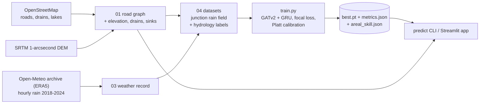

# Namma-Flow

Namma-Flow estimates, for each street junction, the probability that it floods over the next 12–48 hours in Bengaluru's Bellandur / Outer Ring Road corridor, a pilot box of about 4.9 km × 3.9 km. The OpenStreetMap road network is treated as a graph: 1,035 junctions and 2,406 directed street segments, with SRTM elevation and each junction's distance to the nearest mapped drain or lake. Hourly rainfall drives the graph. A spatio-temporal graph neural network learns to reproduce flood labels made by a calibrated urban-drainage simulator (the "teacher"). Per hour, the network runs two GATv2 attention layers over the roads, and a GRU carries the water state from one hour to the next. A Streamlit + pydeck dashboard shows the probabilities as a 3D map for three kinds of input: a live Open-Meteo forecast, a replay of any storm in the 2018–2024 record, or a what-if design storm. The project uses only free data, runs on a laptop CPU, and every stage has an offline fallback.

- Background, design choices and the reasons behind them: [PROJECT_BRIEF.md](PROJECT_BRIEF.md)
- The original specification: [PROJECT_SPEC.md](PROJECT_SPEC.md)

> **Read this first.**
>
> - **The labels are simulated.** No public junction-level flood record exists for this area, so the training labels come from a physics surrogate (`src/hydrology/simulator.py`) calibrated against plausibility criteria, not from observed floods. Every score measures agreement with that surrogate.
> - **The headline score measures emulation, not forecast skill.** The teacher is driven by one random junction rain field per storm, downscaled from the corridor-average rain, and the headline test score is computed while the model sees that exact field. A forecast or a what-if storm knows only the corridor-average rain, so even with perfectly known areal rain it gets the much lower *areal-only* score, and archived forecasts score lower still.
>
> See [Results](#results) and [Limitations](#limitations).

## How it works



1. **Road graph (stage 01).** The drivable network comes from an Overpass bounding-box query over `region.bbox`. The place query is tried first but rejected, because "Bellandur, …" geocodes to the lake polygon. Stage 01 cleans the graph and adds a reverse edge for every segment, since runoff ignores one-way rules. It records the OpenStreetMap snapshot it was built from, then enriches the graph in place with the same code as stage 02:
   - SRTM elevation
   - relative elevation (a 300 m topographic position index)
   - distance to the nearest OSM drain or lake
   - edge grade
   - flow accumulation and sink junctions
2. **Rainfall (stage 03).** Hourly areal precipitation from the Open-Meteo historical archive at the corridor centre.
3. **Datasets (stage 04).**
   - A stochastic moving-convective-cell rain field (`rain_field.py`) downscales each hour's areal rain to individual junctions. It is seeded per rain event (`rainfall_field.seed` and the event's start hour), so every storm of the record has one fixed junction rain field: the one the labels are made from.
   - The hydrology simulator, a lumped dual-drainage model on the road graph, turns junction rain into water depth. A junction counts as flooded at 0.15 m or deeper.
   - Windows are 16 h long (4 warm-up hours and 12 scored hours) and cover the May–Nov monsoon months.
   - Each window is assigned to a split by the year of its last hour: train 2018–2021 and 2023, validation 2022, held-out test 2024.
4. **Training.**
   - Inputs: 10 node features and 2 edge features (length, grade). The node features are elevation, `dist_to_drain_m`, relative elevation, flow accumulation (log-scaled), the sink flag, hourly rain, and 3/6/12/24 h rain sums.
   - Loss and optimiser: focal loss (γ = 2, α = 0.85), AdamW, and early stopping on validation PR-AUC.
   - Finalisation, all on validation: Platt calibration, the alert threshold (best F2), and a second alert threshold for probabilities averaged over rain-field realisations (step 5). Metrics are then reported on the test year, next to two graph-free baselines on the same inputs (logistic regression and HistGradientBoosting), together with the *areal-only skill*: the same test hours scored when the model gets only the corridor-average rain.
5. **Serving.** Replays of the record reuse the exact training field. Forecasts, design storms and custom rain series know only the corridor-average rain, so the junction field is unknown. The predictor therefore averages its probabilities over `inference.field_members` = 32 independent rain-field realisations (Monte Carlo marginalisation; the score levels off at about 32) and reports their spread.

### Data at a glance (real run)

| Item | Value |
|---|---|
| Road graph | 1,035 junctions, 2,406 directed edges (OSM bbox query; OSM snapshot 2026-09-23T12:50:49Z) |
| Elevation | SRTM 1-arcsecond, 868.9–899.8 m |
| Drains / water bodies | 382 OSM features (37 `water=wastewater` tanks excluded) |
| Sink junctions | 260 |
| Rainfall | Open-Meteo (ERA5) hourly, 2018-01-01 → 2024-12-31: 61,368 h, 0 % imputed, mean ≈ 1,009 mm/yr |
| Datasets | train 944 windows (2018–2021, 2023) · validation 103 (2022) · test 103 (2024); seq_len 16, warm-up 4; 2.4–3.3 % of scored node-steps flooded |

The OSM snapshot is the Overpass `timestamp_osm_base` of the cached bbox response. Stage 01 stores it in the graph as `osm_base_utc`. For the published run it was recovered from the Overpass cache after training (the graph attribute digest 16f45ad291f32cd9 is unchanged, so the data is the same). `best.pt`, `dataset_summary.json` and `dataset_manifest.json` still record it as "unknown", and the app's provenance shows it as not recorded, until the datasets are rebuilt and the model is retrained. A graph file written by an older version reports it as not recorded until it is rebuilt with `01_extract_network.py --force --offline`, which replays the same graph from the cache. A fresh clone queries today's OpenStreetMap and may build a slightly different graph, unless `network.osm_date` pins the query to a past snapshot.

Hydrology calibration (`python -m src.hydrology.calibrate`, criteria in its docstring). All criteria pass:

| Criterion | Target | Result |
|---|---|---|
| (a) flooded node-hours, May–Nov | 0.5–3 % | 0.591 % |
| (b) floods when 6 h areal rain < 4 mm | 0 | 0 |
| (c) Sept 4–5 2022 peak, share of junctions flooded | 10–50 % | 42.4 % |
| (e) rain events per year that flood somewhere | ≥ 15 | 41.1 |
| (f) rank-1 (hour × node) R² of the labels | < 0.6 | 0.502 |
| (g) Jaccard of labels vs uniform (non-spatial) rain | < 0.75 | 0.464 |
| (h) median share flooded in hours with any flood | < 25 % | 8.3 % |
| (rf) junction-rain coefficient of variation, wet hours | 0.3–0.7 | 0.464 |

Criterion (d) also passes: floods concentrate at low relative elevation, high flow accumulation and sinks. Criterion (g) also explains why the headline cannot be reached from areal rain: labels simulated with uniform rain overlap the real labels with a Jaccard index of only 0.46, so where the random cells fall decides much of the label pattern.

## Results

<!-- RESULTS:START -->
Final training run: `gatv2_gru`, 47,169 parameters, CPU. 60 of 60 epochs, best epoch
59, 1,920 optimizer steps, ≈ 71 s per epoch (≈ 71 min of summed epoch time). The published run was trained in two
sessions (resumed after epoch 30) and then re-finalised without further epochs, to choose the areal threshold with
32 rain fields; weights, calibration, exact-field threshold and headline metrics did not change. `metrics.json`
`training.total_time_s` (23 s) times only that last process. Everything below was chosen on validation 2022:

- Platt calibration: slope 3.010, intercept -1.882.
- Alert threshold (best F2): 0.196 for exact-field probabilities (replays) and 0.163 for
  probabilities averaged over 32 rain fields (forecasts and what-if storms).

**(a) Given the junction rain field (emulation).** Held-out test year 2024: 103 windows × 1,035 junctions, 1.28 M
scored junction-hours, 2.38 % flooded (a random ranking scores PR-AUC 0.024). The model sees the exact synthetic
junction rain the labels were simulated from. The baselines get the same 10 per-junction-hour inputs, without the
road graph or temporal memory.

| Metric | **Namma-Flow GNN** | HistGradientBoosting (graph-free) | Logistic regression (graph-free) |
|---|---|---|---|
| PR-AUC | **0.953** | 0.902 | 0.699 |
| ROC-AUC | **0.999** | 0.997 | 0.989 |
| F2 @ threshold | **0.908** | 0.872 | 0.730 |
| Precision | **0.767** | 0.656 | 0.456 |
| Recall | **0.952** | 0.951 | 0.860 |
| CSI | **0.738** | 0.634 | 0.424 |
| Brier score | **0.0043** | 0.0063 | 0.0117 |
| ECE | **0.0003** | 0.0011 | 0.0028 |

Validation 2022 (used for epoch selection, calibration and both thresholds, so optimistic): PR-AUC 0.958,
F2 0.917, precision 0.779, recall 0.960.

**(b) Given only corridor-average rain (areal-only skill).** The same test hours and labels, but the model gets only
what a forecast or a what-if storm can supply: the corridor-average rain (`artifacts/reports/areal_skill.json`).
Thresholded columns use the exact-field threshold 0.196 unless the row says otherwise.

| Junction rain given to the model | PR-AUC | ROC-AUC | F2 | Recall | Precision |
|---|---|---|---|---|---|
| Exact label field (the headline, emulation) | 0.953 | 0.999 | 0.908 | 0.952 | 0.767 |
| **Mean over 32 independent fields** (what forecasts and what-if storms serve: the areal-only score) | **0.667** | 0.988 | 0.718 | 0.816 | 0.486 |
| … the same, at the areal serving threshold 0.163 | 0.667 | 0.988 | 0.724 | 0.853 | 0.451 |
| One other field realisation | 0.450 | 0.943 | 0.507 | 0.528 | 0.439 |
| Uniform: corridor-average rain at every junction | 0.632 | 0.983 | 0.616 | 0.614 | 0.625 |
| Physics teacher with another field (p > 0.5; single-field reference) | 0.383 | 0.804 | 0.502 | 0.497 | 0.524 |
| Physics teacher, mean over the same 32 fields (p > 0.5; estimate of the areal-only ceiling) | 0.690 | 0.990 | 0.564 | 0.538 | 0.695 |

How the two ensembles depend on the number of rain fields K (test 2024 PR-AUC, published model). The physics
average is a Monte-Carlo estimate of the areal-only ceiling that is biased low for small K and rises with K:

| Rain fields K | 8 | 16 | 32 | 64 |
|---|---|---|---|---|
| GNN ensemble (areal-only score) | 0.619 | 0.655 | **0.667** | 0.670 |
| Physics teacher ensemble (estimate of the areal-only ceiling) | 0.630 | 0.673 | 0.690 | 0.696 |

**(c) Forecast backtest, 2024-08-01 → 2024-11-28** (120 days including the October 2024 floods; labels simulated
from the best-estimate rain with the label field, 14,882 flooded junction-hours; Open-Meteo Previous Runs).
Each row's recall and precision use the threshold it is served with: the exact-field threshold 0.196 for `lead_0h`, the areal serving threshold 0.163 for the ensemble rows (physics: p > 0.5).

| Row | Rain driving the model | Junction rain field | Rain correlation | Junction-hour PR-AUC | 6 h-block PR-AUC | 24 h-block PR-AUC / recall / precision | Physics on the same rain and fields (junction-hour PR-AUC) |
|---|---|---|---|---|---|---|---|
| `lead_0h` | observed | exact label field | 1.00 | 0.948 | 0.941 | 0.933 / 0.933 / 0.740 | teacher (= labels) |
| `areal_ceiling` | observed: a perfect areal forecast | mean of 32 fields | 1.00 | **0.688** | 0.713 | 0.717 / 0.840 / 0.491 | 0.716 |
| `lead_24h` | 24 h-ahead forecast | mean of 32 fields | 0.21 | 0.070 | 0.101 | 0.153 / 0.323 / 0.194 | 0.049 |
| `lead_48h` | 48 h-ahead forecast | mean of 32 fields | 0.32 | 0.120 | 0.142 | 0.229 / 0.408 / 0.211 | 0.096 |
| Chance level (base rate) | | | | 0.005 | 0.011 | 0.030 | |

Reproduce it with `make backtest` or `python -m src.inference.predict --backtest 2024-08-01 2024-11-28` (online,
about 14 min with 32 fields). Any backtest replaces `artifacts/reports/backtest.json`, which the app shows.

How to read the results:

- **The headline measures emulation.** Table (a) shows how closely the GNN reproduces the teacher when it is given
  the teacher's own random junction rain field. No real input can supply that field, not a perfect forecast and not
  radar, because it is synthetic and drawn once per storm.
- **With areal rain the scores are much lower.** Given only the corridor-average rain, the model reaches PR-AUC
  0.667 on test 2024 (the 32-field ensemble; uniform areal rain 0.632) and 0.688 in the backtest's
  perfect-areal-forecast row, against 0.953 with the exact field. Even the teacher scores only 0.383 when run with
  one other field, and 0.690 when averaged over 32 fields: much of the junction-level label pattern is set by the
  random field and cannot be predicted from areal rain.
- **Why forecasts serve the 32-field mean.** One random field scores 0.450 and is badly over-confident
  (ECE 0.019). Uniform areal rain ranks worse than the ensemble (PR-AUC 0.632 vs 0.667) and is mis-calibrated
  (ECE 0.012, mean probability 1.85 % against a 2.38 % flood rate). The 32-field mean ranks best, is calibrated
  (ECE 0.001, mean 2.32 %) and alerts best: F2 0.724 at its validation-chosen threshold 0.163, against 0.616 for
  uniform rain at the exact-field threshold (and 0.672 even at uniform's test-optimal threshold). So forecast and
  what-if modes serve the ensemble mean with that threshold, and its spread across fields shows the spatial
  uncertainty. The ensemble improves up to about 32 fields (0.619 with 8, 0.670 with 64), which is why 32 are
  served; a 48 h forecast then takes about 4 s.
- **Lead time.** Forecast rain error lowers PR-AUC further, to 0.070 at 24 h and 0.120
  at 48 h: forecast and observed areal rain correlate at only 0.21 and 0.32. Better rain forecasts (ensembles,
  nowcasting) can at most close the gap from these rows to the perfect-areal-forecast row, not to the headline.
- **Warning windows.** The blocks are fixed 6 h / 24 h blocks counted from the period start (calendar days here),
  and a hit means that the junction floods at any hour of the block. At 48 h lead, block scoring raises PR-AUC from
  0.120 to 0.229, mostly because the base rate rises from 0.5 % to 3.0 %. Relative
  to chance, that is 24× for junction-hours and 8× for 24 h blocks. Windows
  forgive timing errors; they do not add skill.
- **Physics column and the areal-only ceiling.** In the ceiling row and at 24/48 h the physics column is the teacher
  driven by the same rain and fields, a fair baseline. Averaged over K fields, the teacher estimates the best any
  predictor can do when only the corridor-average rain is known, but only up to Monte-Carlo error: the estimate is
  biased low for few fields and rises with K, from 0.630 (K = 8) to 0.690 (K = 32) and 0.696 (K = 64) on the test
  year, so the areal-only ceiling is about 0.70. The GNN's 32-field ensemble reaches 0.667, about 0.02–0.03 below
  it (backtest ceiling row: 0.688 against 0.716); that gap is the residual cost of training only on exact fields.
  With real forecasts the GNN is ahead (0.070 vs 0.049 at 24 h, 0.120 vs 0.096 at 48 h).
- **Given the field, the graph adds value and the probabilities are calibrated.** The GNN's margin over
  gradient-boosted trees on the same inputs is +0.050 PR-AUC. It also reflects the GNN's larger training set: the
  baselines are fit on a class-balanced 200k-node-step subsample of 400 of the 944 training windows. Its mean predicted probability on
  test is 2.36 % against an observed 2.38 % (ECE 0.0003; per-bin reliability in `metrics.json` and
  in the app).

Full discussion: [PROJECT_BRIEF.md §10](PROJECT_BRIEF.md#10-results).
<!-- RESULTS:END -->

## Requirements

- Python 3.12+ (`requires-python = ">=3.12"`). Tested on Python 3.13.12, macOS arm64. The pinned stack in `constraints.txt` (numpy 2.5, scipy 1.18, networkx 3.7, pyproj 3.8, rasterio 1.5) needs Python 3.12 or later; networkx 3.7 excludes Python 3.14.1.
- About 2 GB RAM. Training runs at about 1.3 GB (gradient checkpointing is on by default), and calibration peaks at about 1.5 GB. A 120-day backtest with the default 32 rain fields peaked at about 1.9 GB (it holds every field's junction rain for the whole period at once; `--members 8` needs about 1.5 GB), and a 48 h forecast with MC dropout at about 1.3 GB. `data/` takes about 150 MB, most of it the datasets.
- Internet is optional. It is needed once to fetch the real data (OSM, SRTM, Open-Meteo) and later for live forecasts and backtests. Everything else runs offline from the caches, or on synthetic fallbacks (see [Offline use](#offline-use)).
- No GPU is needed. CUDA is used automatically if present.

## Install

```bash
python3.13 -m venv .venv                                        # any Python >= 3.12
.venv/bin/pip install -r requirements.txt -c constraints.txt
```

Or run `make setup`, which checks that `SYSTEM_PYTHON` (default `python3`) is at least 3.12 before it creates `.venv`, for example `make setup SYSTEM_PYTHON=python3.13`. Delete an existing `.venv` built with an older Python first.

- `requirements.txt` holds the minimum versions the code needs. The osmnx floor is 2.1.1, because older osmnx releases cannot replay their response cache offline.
- `constraints.txt` pins the exact versions everything was tested with (torch 2.14.0, torch-geometric 2.8.0.post1, osmnx 2.1.1, streamlit 1.64.0, …).
- If a pinned version has no wheel for your platform, install without `-c constraints.txt`. The floors alone resolve on Python 3.11 or later, but that combination is untested. `make test` then reports the version drift as a skipped test, and `make check-env` fails until the installed versions equal the pins.

## Quickstart

This is the spec's execution sequence. Run it from the project root. Each stage caches its output, and re-running a stage reuses the cache.

| # | Command | What it produces / prints | Time |
|---|---|---|---|
| 1 | `.venv/bin/python src/data_pipeline/01_extract_network.py` | `data/interim/bellandur_osm.graphml` (enriched), plus the SRTM tile, `waterways.geojson` and the osmnx cache. Prints nodes/edges, the network, elevation and drain sources, the OSM snapshot, the elevation range and the sink count | ~1 min online when Overpass answers; < 1 s cached. A busy mirror (HTTP 429/504) costs at most `network.overpass_max_attempts` = 2 attempts, 30 s apart, before the next mirror is tried |
| 2 | `.venv/bin/python src/data_pipeline/04_dataset_builder.py` | Fetches the rainfall record if it is missing (stage 03), then writes `data/processed/{train,val,test}_dataset.pt` together with `dataset_manifest.json`, and `artifacts/reports/dataset_summary.json`. Prints whether it built or reused (and why), the features, the window geometry, the fingerprints and one line per split | ~10 s (+ ~10 s for a first weather fetch) |
| 3 | `.venv/bin/python src/training/train.py` | One log line per epoch (losses, PR-AUC, ROC-AUC, F2, lr, `* best`). At the end it publishes `best.pt`, `metrics.json`, `training_history.csv` and `areal_skill.json` together, and prints a table of PR-AUC, ROC-AUC, F2, precision, recall, CSI, Brier, ECE and log loss for GNN, LogReg and HistGBDT on validation and test, plus one line with the areal-only PR-AUC | ~1–1.5 h on an 8-core laptop CPU (≈ 80 s/epoch, ≤ 60 epochs, early stopping), plus about 7 min of finalisation (baselines, then the areal threshold and the areal-only skill with 32 rain fields each) |
| 4 | `.venv/bin/streamlit run app/app.py` | Dashboard at <http://localhost:8501> | instant |

Until step 3 has published a finalized `best.pt`, the app shows the physics baseline (the label simulator itself) under a banner. The prediction CLI instead exits with a hint to add `--physics`.

Optional stages:

- `src/data_pipeline/02_elevation_engine.py` re-enriches an existing graph. Use it after dropping a GeoTIFF that covers the bbox into `data/raw/dem/` (it is then used as a local DEM), or with `--refresh-dem` / `--refresh-drains`. It prints elevation, void, drain-distance and sink statistics and takes seconds from the caches. After a change to the `elevation`, `drains` or `region` settings, stage 01 and stage 04 also re-enrich the graph by themselves: the graph records the settings it was enriched with (`enrichment_config_hash`).
- `src/data_pipeline/03_weather_ingestion.py` fetches or extends the rainfall record explicitly, for example with `--start/--end`. The 2018–2024 fetch is 7 archive requests and takes about 10 s. It prints a record summary. Stage 04 fetches the record itself when it is missing.
- `python -m src.hydrology.calibrate` re-checks the label calibration (about 10 s, 1.5 GB). It is read-only: a missing graph or rainfall record is built in memory and never written to the project paths.
- `python -m src.training.areal_skill` recomputes `artifacts/reports/areal_skill.json` for the published model (about 3.5–4 min and about 1.4 GB with 32 rain fields). Training writes it automatically.

The same stages are available as `make network | elevation | weather | dataset | train | app`. Run `make help` for the full list.

## Offline use

Each CLI's `--offline` flag, `NAMMA_FLOW_OFFLINE=1` (also `true`/`yes`/`on`) and `project.offline: true` all block every network call. Offline, each input falls back as follows:

| Input | Online | Offline fallback |
|---|---|---|
| Road graph | Overpass bbox query (mirrors in `network.overpass_urls`; a mirror answering HTTP 429/504 is given up after `network.overpass_max_attempts` attempts) | replays the bbox query from `data/interim/osm_cache/`; otherwise a synthetic 20 × 20 street grid over `region.bbox` |
| Elevation | local GeoTIFF → SRTM tile download → Open-Meteo elevation API → synthetic | local GeoTIFF → cached SRTM clip/tile → synthetic valley formula |
| Drains / lakes | Overpass | cached `waterways.geojson` → synthetic north–south drain line at `region.drain_fallback_lon` |
| Rainfall record | Open-Meteo archive | cached CSV → synthetic Bengaluru climatology (ERA5-like areal scale, seeded) |
| Live forecast | Open-Meteo forecast API | replays the most recent notable storm in the record (CLI: `--no-fallback` fails instead) |
| Backtest | Open-Meteo Previous Runs API | unavailable (the CLI exits 1) |
| Basemap | Carto tiles, fetched by your browser | no background map; the data layers still draw |

Fallbacks never silently replace real data:

- Stage 01 refuses (exit 1, graph untouched) to replace a real OSM graph with the synthetic grid, unless you pass `--allow-synthetic`.
- Every re-enrichment (stage 02, stage 01 on a cached graph, stage 04) refuses to replace real SRTM elevations or real OSM drains with synthetic ones. Stages 01 and 02 accept `--allow-synthetic`; stage 04 has no override.
- When only derived attributes are missing (relative elevation, flow accumulation, sinks, grade), they are recomputed from the stored elevations, without the DEM or drain caches.
- A cached synthetic grid protects nothing, so the next online stage 01 rebuilds it from OpenStreetMap automatically.

After one online run has filled the caches, the whole real pipeline re-runs offline, for example `NAMMA_FLOW_OFFLINE=1 make dataset`.

**Fully offline demo, no internet and no real data needed:**

```bash
make offline-demo                                  # DEMO_DIR=/tmp/namma-flow-demo by default
make app CONFIG=/tmp/namma-flow-demo/config.yaml   # dashboard on the demo data
make clean-demo                                    # delete it again
```

`offline-demo` works as follows:

1. `make demo-config` (run automatically) checks `DEMO_DIR`, then writes `$(DEMO_DIR)/config.yaml`, a copy of `CONFIG` with `project.offline: true` and every `paths.*` entry moved under `DEMO_DIR`, and a marker file `.namma-flow-demo` that lists what the demo creates.
2. It runs stages 01, 03 and 04 offline.
3. It trains for `DEMO_EPOCHS=3` epochs of `DEMO_WINDOWS=64` windows.
4. It runs two predictions into `$(DEMO_DIR)/artifacts/reports/`: the offline forecast fallback, which is a replay, and the Cloudburst design storm with 5 MC-dropout samples.

The demo can never touch the project's `data/`, `artifacts/` or `config/`:

- `DEMO_DIR` must be a new or empty folder, or one prepared earlier by `make demo-config`.
- It is refused when it is `/`, `$HOME` or one of its ancestors, the project folder or one of its ancestors, a folder inside or containing the project's `data/`, `artifacts/` or `config/`, or a folder whose `config.yaml` would be `CONFIG` itself.
- `make clean-demo` deletes only the entries the marker lists (the demo config, `data/` and `artifacts/`), then the marker, then the folder if nothing else is left in it.
- A demo folder made by an older Makefile has no marker and is refused. Delete it by hand once.

The demo inputs are all synthetic: a 400-junction grid, valley-formula elevation, a straight drain and synthetic rain. The demo exercises the software, and its numbers mean nothing; the dashboard says so in a *Synthetic demo data* banner. When no graph exists, the app's setup page also offers **Build the graph offline**. That button replays the real OSM graph from the osmnx cache when one exists, else it generates the synthetic grid, and writes the result to the configured `paths.graph_file`. It falls back to the synthetic grid only when no graph file exists or the existing one is itself synthetic.

## CLI reference

Every CLI accepts `--config CONFIG` (default `$NAMMA_FLOW_CONFIG`, else `config/config.yaml`) and `--offline`. On a handled failure, each prints a one-line error on stderr and exits 1. Success exits 0. On Ctrl-C they exit 130, except stage 03 and calibrate, which exit 1. Set `NAMMA_FLOW_LOG_LEVEL=DEBUG` to log tracebacks of unexpected errors.

**`python src/data_pipeline/01_extract_network.py [-h] [--config CONFIG] [--offline] [--force] [--allow-synthetic]`**

| Flag | Meaning |
|---|---|
| `--force` | ignore the cached graph file and rebuild it (offline: from the osmnx cache, which also records the OSM snapshot `osm_base_utc`) |
| `--allow-synthetic` | allow replacing an existing OpenStreetMap graph (or its real elevation / drain attributes) with synthetic fallbacks |

**`python src/data_pipeline/02_elevation_engine.py [-h] [--config CONFIG] [--offline] [--refresh-dem] [--refresh-drains] [--allow-synthetic]`**

| Flag | Meaning |
|---|---|
| `--refresh-dem` | ignore cached SRTM GeoTIFF/tiles and download again (ignored with a warning offline) |
| `--refresh-drains` | ignore the cached waterways GeoJSON and query OSM again |
| `--allow-synthetic` | accept synthetic elevation/drain fallbacks even when the graph currently holds real SRTM/OSM data |

**`python src/data_pipeline/03_weather_ingestion.py [-h] [--config CONFIG] [--offline] [--force] [--start START] [--end END]`**

| Flag | Meaning |
|---|---|
| `--force` | refetch the whole range even if the cache covers it |
| `--start` / `--end` | override `weather.start_date` / `weather.end_date` (`YYYY-MM-DD`, end inclusive); the cache never shrinks, and a disjoint range is stored as a separate block |

Hours between two stored blocks are never bridged with fabricated rain: replays refuse to start there (see `predict` below).

**`python src/data_pipeline/04_dataset_builder.py [-h] [--config CONFIG] [--offline] [--force]`**

| Flag | Meaning |
|---|---|
| `--force` | rebuild even if up-to-date datasets exist. Without it, the builder rebuilds only when the dataset config hash, the graph topology/attributes, the weather record or the flood reports changed, or when the split files lack a matching `dataset_manifest.json`, and it says which |

The three split files are written to temporary files first and renamed together, and the manifest is written last. An interrupted build therefore leaves either the previous build or a detectable incomplete one, never a silent mix of two builds.

**`python src/training/train.py [-h] [--config CONFIG] [--epochs EPOCHS] [--device {auto,cpu,cuda,mps}] [--resume] [--windows-per-epoch N] [--max-val-windows N] [--num-threads N] [--offline]`**

| Flag | Meaning |
|---|---|
| `--epochs` | total epochs (default `model.epochs` = 60) |
| `--device` | training device (default `training.device` = `auto`: CUDA if available, else CPU) |
| `--resume` | continue from `last.pt` in `paths.checkpoint_dir`. Refused when the model, the features/graph/scaler or the dataset build differ (`build_id`, dataset config hash, weather or flood-report fingerprint). If only the validation windows changed (`--max-val-windows`), the best candidate is re-scored on the current validation set and early stopping restarts from it |
| `--windows-per-epoch` | windows sampled per epoch; 0 = every window (default 512 = 32 steps of 16) |
| `--max-val-windows` | evenly spaced validation windows scored per epoch; 0 = all (default: all). The final calibration, thresholds and reports always use every validation window |
| `--num-threads` | torch CPU threads (default `training.num_threads`, else torch's default) |
| `--offline` | only matters if the datasets must be built first (missing datasets are built automatically) |

Training refuses train/validation/test files that come from different dataset builds (for example after an interrupted rebuild).

**`python -m src.inference.predict [options]`**. Also runnable as `python src/inference/predict.py`.

| Flag | Meaning |
|---|---|
| `--scenario {forecast,design,historical}` | default `forecast`; offline or on API failure, it replays the latest notable event unless `--no-fallback` |
| `--total-mm`, `--duration-h` | custom design storm: rain-gauge total (mm) and duration (h) |
| `--preset PRESET` | a design storm from `inference.design_storms` by name prefix (case-insensitive) or index: `0` Moderate shower 30 mm/3 h, `1` Heavy downpour 80 mm/3 h, `2` Cloudburst 130 mm/6 h. Cannot be combined with `--total-mm`/`--duration-h` |
| `--storm-offset-h` | hours from the first target hour to the storm start (default 6) |
| `--rain-scale` | gauge → areal factor for design storms (default `inference.design_storm_rain_scale` = 0.14) |
| `--start` | historical replay start, ISO local time, e.g. `2022-09-04T12:00`. Starts outside the record, in a gap between stored blocks or on gap-filled hours are refused |
| `--hours` | target hours (default 48 = max of `inference.horizons_h`) |
| `--mc [N]` | MC-dropout samples for uncertainty (bare `--mc` = 20; at most 200) |
| `--members K` | rain-field realisations averaged when only areal rain is known: forecasts, design storms and the backtest's ceiling and forecast rows (default `inference.field_members` = 32, at most 64). Replays always use the exact training field |
| `--physics` | use the physics baseline (the label simulator) instead of the GNN; works before any model exists |
| `--checkpoint`, `--device`, `--threads` | checkpoint path (default `paths.checkpoint_dir/best.pt`), device (default `cpu`), torch threads |
| `--out`, `--csv`, `--timeline` | GeoJSON output (default `paths.reports_dir/prediction.geojson`), optional per-junction CSV, include hourly probabilities in the GeoJSON |
| `--top N` | riskiest junctions to print (default 10) |
| `--no-fallback` | fail instead of replaying the latest notable event when the forecast is unavailable |
| `--backtest START END` | forecast backtest instead of a prediction; see below |

A prediction prints the scenario, the predictor and its alert threshold, the number of rain-field members and GNN passes, the target period, the junctions at risk per horizon and overall (with the range across single rain fields), the risk-tier counts, caveat notes and the top-N junction table, then writes the GeoJSON.

- **Rain-field ensemble.** A forecast or design storm runs K rain-field members. With `--mc N` the GNN runs max(K, N) passes, pass *i* on member *i* mod K, with dropout on. The reported probability is the mean over the passes, and `±` is their spread across rain fields and dropout. A 48 h forecast with the default 32 members takes about 4 s on CPU. `--mc N` with N ≤ 32 adds no passes; it switches dropout on for the 32 member passes. Design storms of every size share the same members (a canonical storm-anchored time axis), so storms stay comparable.
- **Threshold.** Ensemble-averaged probabilities are compared with the areal serving threshold chosen on validation (`best.pt["areal_threshold"]`); replays use the exact-field threshold. The result metadata records which one as `threshold_kind` (`areal_ensemble` or `exact_field`).
- **Per junction.** The table and the CSV also give the share of rain fields in which each junction reaches the threshold.

`--backtest` needs the network. It works as follows:

1. It fetches Open-Meteo "Previous Runs" data (available from about 2024): the best-estimate rain plus the 24 h- and 48 h-ahead forecasts, and 72 h of spin-up before the period. The period can be at most 120 days.
2. It builds "truth" by driving the simulator with the best-estimate rain and the label field (the base `rainfall_field.seed`), exactly as training labels are made.
3. It scores four rows, each at the alert threshold the predictor serves it with (for the GNN: the exact-field threshold for the replayed label field, the validation-chosen areal threshold for rain-field ensembles; physics: p > 0.5):
   - `lead_0h`: the observed rain with the exact label field (emulation, as in training);
   - `areal_ceiling`, "perfect areal forecast (ensemble)": the same observed areal rain, but with K independent rain fields, since no forecast knows the label field. This is what this model reaches with a perfect areal forecast; the physics column (the teacher averaged over the same fields) estimates the best possible, a Monte-Carlo estimate that is biased low for few fields;
   - `lead_24h` / `lead_48h`: the archived forecasts, with the same K-field ensembles.

   Ensemble rows use seed offset 1, so no member reuses the label field. Each row reports junction-hour metrics, "any junction flooded in the hour", warning windows (fixed 6 h and 24 h blocks from the period start: does the junction flood at any hour of the block) and the rain-forecast skill.
4. With the GNN, the physics baseline is run on the same rain and fields. At lead 0 it is the label generator itself, so it is marked `teacher (= labels)`.
5. It writes `artifacts/reports/backtest.json`, replacing the previous one. A backtest with `--physics` writes `backtest_physics.json` instead (its own lead-0 row is the teacher), so it never overwrites the GNN report.

A 120-day backtest with the default 32 members takes about 14 min (829 s for the published period). It holds every member's junction rain for the whole period at once: it peaked at about 1.9 GB with 32 members (about 1.5 GB with 8). The published report is reproduced by `make backtest`, whose `BACKTEST_START`/`BACKTEST_END` default to 2024-08-01 / 2024-11-28.

Examples:

```bash
python -m src.inference.predict --scenario design --preset cloudburst --storm-offset-h 0 --hours 12 --physics
python -m src.inference.predict --scenario historical --start 2022-09-04T12:00 --hours 48 --mc 20
python -m src.inference.predict --scenario forecast --members 16
python -m src.inference.predict --backtest 2024-08-01 2024-11-28   # the published period (= make backtest)
```

**`python -m src.training.areal_skill [-h] [--config CONFIG] [--offline] [--members N] [--split {test,validation}] [--threads N]`**

This scores the published `best.pt` on a dataset split (default: test) when only the corridor-average rain is known, and writes `artifacts/reports/areal_skill.json`. Rows: `exact_field` (the teacher's own field, i.e. the headline), `field_ensemble` (mean over N independent fields, default `training.areal_skill.members` = 32: the areal-only score), `single_other_field`, `uniform_areal` (areal rain at every junction), `physics_other_field` (the teacher re-run with one other field, scored against its own labels at p > 0.5: a single-field reference), `physics_field_ensemble` (the teacher averaged over the same N fields, scored the same way: an estimate of the areal-only ceiling that rises with N) and, when `best.pt` carries an areal threshold, `field_ensemble_at_areal_threshold` (the ensemble scored at the areal serving threshold). The printed table lists every row; the last one appears as `field_ensemble @ 0.163`. With 32 fields it takes about 3.5 min. Every field is regenerated over the full weather record; if the label field cannot be reproduced (the record or the rain-field settings changed since the datasets were built), nothing is written and the command exits 1. `--split validation` writes the same file, and the app then labels the table "val" and keeps the test score in the KPI.

**`python -m src.hydrology.calibrate [-h] [--config CONFIG] [--offline] [--set KEY=VALUE] [--json PATH] [--strict] [--no-uniform]`**

This runs the full label chain exactly as stage 04 does (graph → rain record → junction rain field → simulator) and prints criteria (a)–(h) and (rf). It never writes the graph or the rainfall record.

| Flag | Meaning |
|---|---|
| `--set KEY=VALUE` | override a hydrology key (`--set spill_depth_m=0.5`) or a dotted config key (`--set rainfall_field.n_cells=4`); repeatable, values parsed as YAML |
| `--json PATH` | also write the statistics as JSON |
| `--strict` | exit with code 1 when a criterion fails |
| `--no-uniform` | skip the uniform-rain simulation (criterion (g) becomes n/a; about 2× faster) |

**`streamlit run app/app.py`**. The app has no flags of its own. It reads `$NAMMA_FLOW_CONFIG` (else `config/config.yaml`) and the `app` config section, and accepts the usual Streamlit flags, e.g. `--server.port 8501 --server.headless true`.

**Makefile.** `make help` lists the targets. Variables:

- `PY` (default `.venv/bin/python`) and `SYSTEM_PYTHON` (creates the venv in `make setup`, default `python3`, must be ≥ 3.12)
- `CONFIG`, `ARGS` (extra CLI flags, e.g. `make dataset ARGS=--force`) and `REPORTS_DIR` (for `clean-reports`)
- `PRESET` and `PREDICTOR` (`make predict` runs the physics Cloudburst; `make predict PREDICTOR=` uses the GNN)
- `BACKTEST_START`/`BACKTEST_END` (default 2024-08-01 / 2024-11-28, the published period; `make backtest ARGS=--physics` writes `backtest_physics.json`)
- `CALIBRATE_ARGS` (default `--strict`), `PYTEST_ARGS` and `STREAMLIT_ARGS`
- `DEMO_DIR`, `DEMO_EPOCHS` and `DEMO_WINDOWS`

`make clean-reports` deletes only regenerable CLI outputs (`prediction.geojson`, `prediction.csv`, `backtest.json`, `backtest_physics.json`). It keeps `metrics.json`, `training_history.csv` and `areal_skill.json` (published together with `best.pt`) and `dataset_summary.json`. `make check-env` fails unless every installed package equals its `constraints.txt` pin.

## App tour

- **Sidebar**, top to bottom:
  - **Scenario.** Choose the mode:
    - *Live forecast (Open-Meteo)*: cached for 30 min, with a Refresh button.
    - *Historical replay*: the 12 wettest 24 h periods of the record, or any date and hour. Events that include synthetic or gap-filled hours say so, and the caption lists the stored blocks of the record.
    - *What-if design storm*: the three presets or a custom total/duration, the storm start offset, and the gauge → areal factor under *Advanced*.
  - **Predictor.** *Namma-Flow GNN* or *Physics baseline*.
  - **Time.** Horizon 12/24/36/48 h, a *Peak over horizon* toggle, and an hour slider.
  - **Alerts & uncertainty.** The alert threshold defaults to the model's validation-chosen threshold for the mode: the exact-field threshold for replays, the areal threshold for forecasts and what-if storms. MC-dropout samples can be added.
  - **Map.** 3D columns, colour scale (Auto / Risk tiers / Relative), light, dark or road basemap, and road and drain/lake layers. The drain/lake layer excludes the same water features (treatment tanks, pools) as the model's distance-to-drain feature.
  - **Clear cached data** reloads everything from disk.
- **Main panel**, top to bottom:
  - A header that names the predictor and the graph actually loaded, and a *Synthetic demo data* banner when the street grid, the elevation or the rain record is synthetic. A badge shows the number of rain fields in forecast and what-if modes.
  - KPIs: junctions at risk (in forecast and what-if modes also the range across single rain fields), maximum probability, peak hour, rain over the horizon and a skill tile that depends on the predictor and the mode:
    - GNN replays show the test PR-AUC *given junction rain* (emulation), with the delta against the strongest graph-free baseline;
    - GNN forecasts and what-if storms show the areal-only field-ensemble PR-AUC *given areal rain* (0.667), with no delta, from `areal_skill.json` (or the summary training stores in `metrics.json`). Without an areal-only score for the loaded model they show the headline, marked "not this mode's skill";
    - with the physics baseline, replays show "teacher" (the simulator runs on the label field itself), while forecasts and what-if storms show "Physics PR-AUC given areal rain" (0.690): averaged over rain fields, the teacher is a genuine predictor there.
  - The 3D junction map.
  - The rainfall hyetograph and the risk-tier distribution.
  - The riskiest junctions (with the share of rain fields in which each one is at risk) next to a per-junction timeline, with a link to the OSM node.
  - Downloads: GeoJSON, junction CSV and rainfall CSV.
  - *About the model*: GNN vs baselines on test and validation, the table "Skill when only corridor-average rain is known (test 2024)" from `areal_skill.json`, a reliability chart, the model card (with both alert thresholds: 0.196 exact field for replays, 0.163 for the rain-field ensembles of forecasts and what-if storms), the training history and the four-row backtest table with its warning-window columns. The backtest caption names both thresholds too (0 h row / ensemble rows).
  - *Data provenance*.
- Every failure mode degrades to a message or a documented fallback instead of a traceback: no graph, no model, no weather, forecast down, or offline. When the GNN cannot be used, the banner gives the fix for that exact cause: rebuild the datasets and retrain for a checkpoint that does not match the graph or data, `train.py --resume` for an unfinished run, `train.py` for a missing model. Set `NAMMA_FLOW_DEBUG=1` to also show tracebacks in the page.

## Outputs and artifact layout

```text
data/                                              # generated, git-ignored (except .gitkeep placeholders and the flood-reports template)
├── raw/dem/N12E077.hgt.gz, srtm_<bbox>.tif        # SRTM tile (~11 MB) and its bbox clip
├── raw/weather/open_meteo_hourly.csv (+ .meta.json)  # timestamp, precipitation_mm, is_imputed, source
├── raw/labels/flood_reports.csv                   # header-only template for observed reports
├── interim/bellandur_osm.graphml                  # enriched road graph (stages 01/02)
├── interim/waterways.geojson, osm_cache/          # OSM drains/lakes cache, osmnx HTTP cache (offline rebuilds)
├── processed/{train,val,test}_dataset.pt          # ~104 / 17 / 18 MB
└── processed/dataset_manifest.json                # build id + size and sha256 of each split (written last)
artifacts/
├── checkpoints/best_candidate.pt   # per-epoch best during training, uncalibrated, never served
├── checkpoints/last.pt             # written every epoch; used by --resume
├── checkpoints/best.pt             # published at the end: calibration, both thresholds, finalized_utc, published_id (the only file served)
├── reports/dataset_summary.json    # stage 04 summary (splits, flood rates, fingerprints)
├── reports/.training_history.partial.csv  # per-epoch history of the run in progress (staging file)
├── reports/training_history.csv    # one row per epoch of the published run
├── reports/metrics.json            # final metrics
├── reports/areal_skill.json        # skill with only corridor-average rain known
├── reports/prediction.geojson      # predict CLI (default --out)
├── reports/backtest.json           # predict --backtest (GNN)
└── reports/backtest_physics.json   # predict --backtest --physics
```

`best.pt`, `metrics.json`, `training_history.csv` and `areal_skill.json` appear only when training finishes, moved into place together. An interrupted or crashed run therefore never replaces a previously published model or its reports; its curve stays in the staging file. A re-finalized model gets a new `created_utc` and `published_id`, so an older backtest or areal-skill report is flagged as belonging to another checkpoint. The model files record dataset paths relative to the project root, and no report carries an absolute path. Console output does, so captured logs are not kept in `artifacts/`. `metrics.json` puts the test split (2024) first. Validation (2022) selected the epoch, the calibration and both thresholds, so validation scores are optimistic.

## Configuration

Everything lives in `config/config.yaml`. The sections are `project`, `paths`, `region`, `network`, `elevation`, `drains`, `weather`, `rainfall_field`, `hydrology`, `labels`, `dataset`, `model`, `loss`, `training`, `inference` and `app`.

- Paths are relative to the project root unless absolute.
- Every section except `project` and `paths` (which must be present, even if empty) is optional, because each module carries its own defaults. Omitted keys take those defaults, except in the dataset config hash, which hashes the `rainfall_field`, `hydrology`, `labels` and `dataset` sections exactly as written: adding or removing a key there, even one set to its default, marks datasets and models stale.
- Values are validated at load time. For example, `model.node_in_dim` must equal `len(static_features) + 1 + len(rolling_windows_h)` of the effective dataset settings (10 with the defaults).
- **What marks datasets and models stale.** The dataset config hash covers only settings stage 04 applies itself: the whole `rainfall_field`, `hydrology`, `labels` and `dataset` sections (as written), plus `project.timezone`, `region.bbox`, `elevation.max_abs_grade` and the record-shaping `weather` keys (`provider`, `start_date`, `end_date`, `latitude`, `longitude`, `models`, `bias_correction_factor`, `max_precip_mm_h`, `max_fill_gap_hours`, `synthetic_scale`). Changing one of them makes stage 04 rebuild, training warn about stale datasets, and the app flag a model trained on older data. Fetch-only keys (URLs, timeouts, retries, forecast settings) never do.
- Everything upstream is covered by content fingerprints: the graph's topology signature and attribute digest, the weather fingerprint and the flood-reports fingerprint. The `elevation`, `drains` and `region` settings a graph was enriched with are stored in the graph (`enrichment_config_hash`); when they change, stage 01 and stage 04 re-enrich the graph with a warning.

| Environment variable | Effect |
|---|---|
| `NAMMA_FLOW_CONFIG` | alternative config file for every CLI and the app |
| `NAMMA_FLOW_OFFLINE` | `1`/`true`/`yes`/`on` forces offline mode |
| `NAMMA_FLOW_LOG_LEVEL` | log level on stderr (`DEBUG`, `INFO` (default), `WARNING`, …) |
| `NAMMA_FLOW_DEBUG` | `1` shows tracebacks in the Streamlit page (they are always in the server log) |
| `NAMMA_FLOW_NETWORK_TESTS` | `1` runs the `network`-marked tests and lifts the tests' forced offline mode |
| `NAMMA_FLOW_STRICT_ENV` | `1` makes the environment test fail (instead of skip) when an installed package differs from its pin (`make check-env`) |

Commonly changed keys:

- `training.device` and `training.num_threads`
- `model.epochs`, `training.windows_per_epoch` and `training.early_stopping_patience`
- `dataset.val_years` and `dataset.test_years` (`[]` means no test split)
- `labels.source`: `simulated` (default), or `observed` / `hybrid` once `flood_reports.csv` has rows
- `inference.design_storm_rain_scale`
- `inference.field_members`: rain-field realisations averaged in forecast and what-if modes (default 32, at most 64; time grows linearly with it); `training.areal_skill.members` (default 32) for the areal-only evaluation and the areal serving threshold, kept equal to it
- `network.osm_date`: pin the Overpass queries to an OSM snapshot, e.g. `"2026-09-23T12:50:49Z"`; `network.overpass_max_attempts` / `overpass_retry_pause_s` bound the retries of a busy mirror
- `model.architecture: a3t_gcn`, an alternative to the spec's `gatv2_gru`

## Running tests

```bash
.venv/bin/python -m pytest                                    # full suite (make test)
.venv/bin/python -m pytest -m unit                            # markers: unit, integration, e2e, network
.venv/bin/python -m pytest --cov --cov-report=term-missing    # line coverage of src/ and app/ (make coverage)
NAMMA_FLOW_NETWORK_TESTS=1 .venv/bin/python -m pytest -m network   # opt-in tests against the live APIs
make check-env                                                # fail unless the installed packages equal constraints.txt
```

Current state: more than 1,400 tests in 40 modules. By default 5 are skipped: the 4 `network` tests and one optional torchvision cross-check. On a fresh clone, before the real graph and weather record exist, the real-record calibration test is skipped as well (6).

- Every test is forced offline, and fixtures redirect all paths into a temporary directory.
- The one exception is `tests/test_hydrology_calibration.py::test_calibrated_defaults_meet_every_criterion_on_the_real_record`. It reads the real graph and rainfall record read-only, is skipped when they are absent, takes about 8 s and 1.5 GB, and fails if regenerated inputs break the calibration criteria.
- The environment test reports drift from the pins as a skip, so a floors-only install still gets a green `make test`. `make check-env` enforces the pins.

## Troubleshooting

- **Overpass refuses connections, is busy or hangs** (stage 01/02). A mirror that answers HTTP 429/504 is retried at most `network.overpass_max_attempts` times, `network.overpass_retry_pause_s` apart, with a WARNING per attempt; then the next mirror in `network.overpass_urls` is tried. Add or reorder public mirrors there, and raise `network.request_timeout_s` / `drains.request_timeout_s` if needed. When every mirror fails, an existing real graph is kept (exit 1), never replaced by the synthetic grid.
- **Stale datasets** ("datasets are stale" in the training log, or an "older data configuration" notice in the app). Rebuild with `04_dataset_builder.py --force`, then retrain from scratch: `--resume` refuses a different dataset build, and `train.py` alone keeps using the stale files.
- **"The best.pt checkpoint is not finalized"** or **"No trained model at …"**. Only a `best.pt` published at the end of a training run is served. Let the run finish, or continue an interrupted one with `train.py --resume`. Meanwhile the app shows the physics baseline, and the CLI suggests `--physics`.
- **"The checkpoint was trained on a different road graph" / "The road graph's attributes (…) differ"**. The graph changed after training (stage 01/02 re-run). Rebuild the datasets (`04_dataset_builder.py --force`) and retrain.
- **"The train and val datasets come from different dataset builds"**. A rebuild was interrupted between split files. Run `04_dataset_builder.py --force`.
- **Replay refused: "falls in a gap of the weather record" or "falls on gap-filled hours"**. Those hours were never observed. Pick a start inside a stored block (the replay caption lists them).
- **The skill tile says "not this mode's skill"** in forecast or what-if mode. There is no `areal_skill.json` for the loaded model. Run `python -m src.training.areal_skill` (training writes it automatically).
- **Memory**. Training is sized for about 2 GB. To go lower:
  - decrease `training.micro_batch_size` (4 → 2; the gradient is unchanged)
  - keep `model.gradient_checkpointing: true` (the default; `auto` or `false` is faster but uses up to ~2.5 GB)
  - lower `model.max_chunk_edges`

  For inference, lower `inference.batch_windows`, `inference.field_members` and the MC samples.
- **Apple-silicon GPU (MPS) is not used.** `device: auto` picks CUDA or CPU and never MPS: several PyG scatter kernels fall back to CPU there, and MPS was no faster in benchmarks at this graph size. To force it, use `--device mps` or `training.device: mps`. On CPU, `--num-threads` (e.g. cores − 1) matters more.
- **Installing the pins fails.** Check that the venv's Python is at least 3.12. Otherwise drop `-c constraints.txt` and use the version floors in `requirements.txt` (Python ≥ 3.11, untested).
- **`make offline-demo` / `clean-demo` refuses DEMO_DIR.** The folder is protected or was not made by `make demo-config` (see [Offline use](#offline-use)). Choose a new folder.
- A `torch.jit.script is deprecated` FutureWarning at start-up comes from a dependency and is harmless.

## Project layout

```text
Namma-Flow/
├── config/config.yaml        # all settings (commented)
├── src/
│   ├── data_pipeline/        # stage CLIs 01_…04_*.py; network* (+ overpass_guard), elevation*, enrichment, terrain,
│   │                         # drains, weather*, rain_field, features, dataset* (+ dataset_manifest), windows,
│   │                         # provenance, sequence_dataset, graph_io
│   ├── hydrology/            # simulator (label teacher), drainage, params, calibrate, label_diagnostics, observed
│   ├── models/               # stgcn.py (GATv2+GRU, A3T-GCN), loss.py (focal, weighted BCE)
│   ├── training/             # train.py CLI, trainer, finalize, calibration, metrics, baseline, checkpoint, splits,
│   │                         # areal_skill (+ areal_fields), evaluation, reports, run_state, settings
│   ├── inference/            # predict.py CLI, predictor, field_ensemble, scenarios, record, results, backtest,
│   │                         # checkpoint_loading, errors, settings
│   └── utils/                # config, logger, http, geo, runtime, demo_dir
├── app/                      # app.py + banners, components, loaders, map_layers, metrics_view
├── tests/                    # pytest suite and shared fixtures
├── data/, artifacts/         # generated (see above)
├── Makefile, requirements.txt, constraints.txt, pyproject.toml
└── PROJECT_SPEC.md, PROJECT_BRIEF.md, namma_flow_project_context.md (identical copy of the spec)
```

## Limitations

- **The labels are simulated.** Flood labels come from a calibrated physics surrogate, not from observed floods. They were tuned to plausibility criteria (flood frequency, the Sept-2022 event, spatial structure), not validated against inundation records. Every reported score measures agreement with that surrogate. `labels.source: observed | hybrid` can fuse real reports from `data/raw/labels/flood_reports.csv`, which ships header-only because fabricated observations would contaminate the labels.
- **The junction rain field is synthetic and unknowable.** The labels come from one random junction rain field per storm. Only replays of the record reproduce it. Forecasts, design storms and custom rain know only the corridor-average rain, so their predictions are an average over 32 field realisations: the areal amounts and timing are what the input says, while per-junction patterns are expected values, not a prediction of where the cells will fall. Even with perfectly known areal rain, the model's areal-only score is 0.667 PR-AUC on test 2024, not the headline (0.953), and the teacher itself, averaged over rain fields, reaches only about 0.70: a large share of the junction-level label pattern is unpredictable from areal rain by construction.
- **The areal-only ceiling is about 0.70, and the GNN is 0.02–0.03 below it.** The model is trained on exact fields and, in forecast and what-if modes, averages over 32 fields to estimate the risk under an unknown field. The physics teacher averaged over the same fields estimates the best possible predictor given only corridor-average rain; that Monte-Carlo estimate is biased low for few fields and converges to about 0.70 (0.690 with 32 fields, 0.696 with 64). The GNN's 32-field ensemble reaches 0.667: the difference is the residual cost of training only on exact fields. A second, areal-trained GNN was evaluated but not built. A probe that trained gradient-boosted trees directly on corridor-average inputs gained only +0.005 PR-AUC over the same trees trained on exact fields (0.618 → 0.623, both scored with corridor-average test inputs), and the gap to the ceiling bounds the expected gain at about 0.03. The larger gap, from the 0.95 headline to about 0.70, is the randomness of the synthetic storm cells, not a modelling shortfall.
- **Forecast-driven skill is lower still.** Scores given the field, or given perfect areal rain, are not forecast skill: rain-forecast error at 24–48 h lowers them further. Only the backtest measures skill with archived forecasts, and its data starts around 2024.
- **ERA5 smooths convective peaks.** Open-Meteo's reanalysis comes from one grid point near the corridor centre, and it spreads short cloudbursts out. On Sept 4–5 2022 about 130 mm fell at rain gauges in 24 h, while ERA5 has about 22 mm of areal rain over the same 24 h (27.5 mm over the two calendar days; the 16:00–20:00 burst on Sept 4 is 17.9 mm). The hydrology parameters are therefore effective values for reanalysis-scale rain.
- **Design storms are rescaled.** Their totals are gauge amounts, multiplied by `inference.design_storm_rain_scale = 0.14` to reach the ERA5 scale the model was calibrated on. The factor was chosen from the 5 h burst (17.9 / 130 mm); the same-24 h ratio would be about 0.17. The "130 mm Cloudburst" is fed as about 18 mm of areal rain.
- **The OSM graph is a snapshot.** The published results use the OSM data of 2026-09-23 (a snapshot recovered from the Overpass cache after training; the model and dataset files record it as "unknown", see [Data at a glance](#data-at-a-glance-real-run)). `data/` is not shipped, so a fresh clone builds from current OSM unless `network.osm_date` is set.
- **The scope is small.** The model covers one pilot box, 1,035 junctions, only the May–Nov season, and CPU-scale models. Offline synthetic fallbacks exist to keep the software runnable; their outputs have no physical meaning.

## License and data attribution

The repository does not include a `LICENSE` file yet. Choose one before redistributing the code. The data it downloads carries its own terms:

- **Road network, drains and lakes:** © OpenStreetMap contributors, available under the [Open Database License (ODbL) 1.0](https://opendatacommons.org/licenses/odbl/). Derived files such as `bellandur_osm.graphml` and `waterways.geojson` are ODbL too.
- **Elevation:** SRTM 1-arcsecond (NASA / USGS), public domain, fetched from the AWS Terrain Tiles ("skadi") bucket. The Open-Meteo elevation API is used only as a fallback.
- **Rainfall:** [Open-Meteo](https://open-meteo.com/) (historical archive, forecast and Previous Runs APIs), licensed CC BY 4.0. The archive is based on ECMWF ERA5 reanalysis from the Copernicus Climate Change Service.
- **Basemap:** © [CARTO](https://carto.com/attributions), © OpenStreetMap contributors. The tiles are loaded by the browser and are subject to CARTO's basemap terms.
